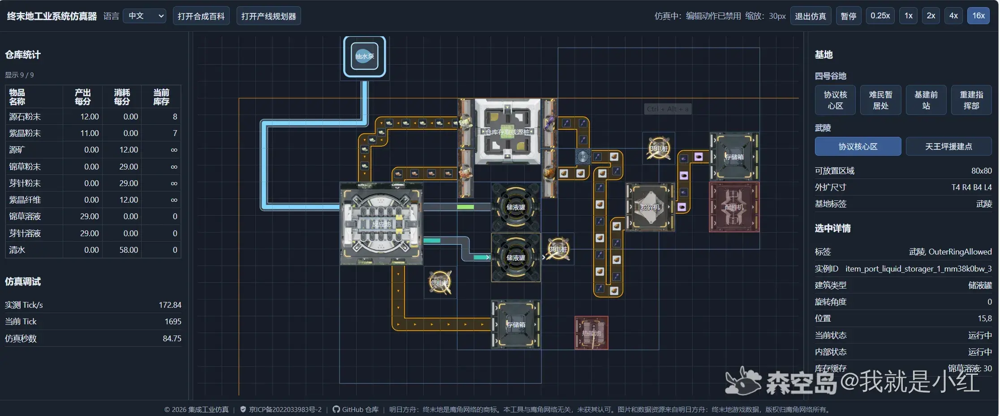
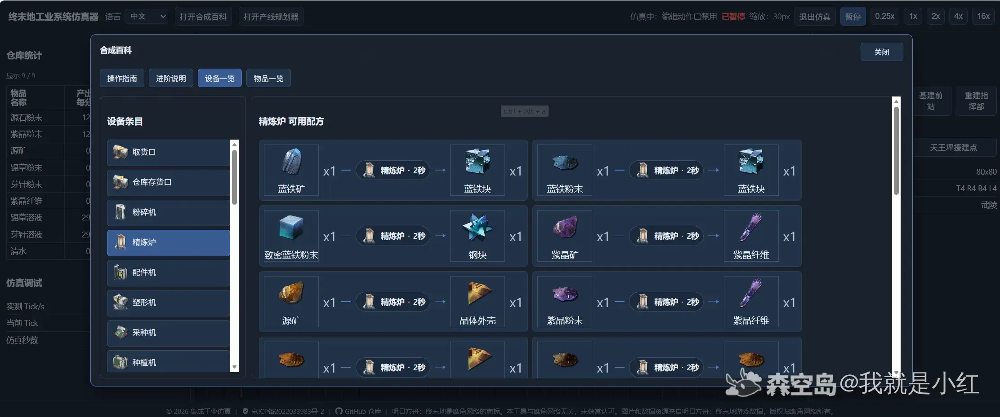
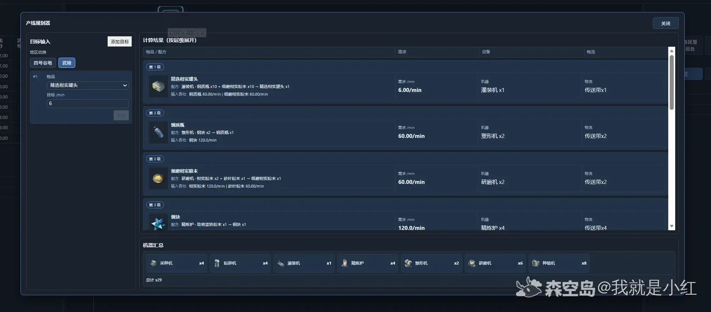

# 【网页仿真】浏览器里运行集成工业！

不想打开游戏又想玩集成工业？想要设计产线又觉得游戏里操作麻烦？设计好了产线要等好久才能看出对错？

现在这些都有办法解决了，只需要访问这个网页版的集成工业仿真系统。

网页地址：  
https://endfield.anonymous-test.top/

> 仅限电脑！没有做小屏幕兼容！屏幕太小可能会导致 UI 挤在一起。

---

## 这是什么？

这是一个可以进行完整产线布置和运行的网页系统，并且还做了一些改进。

### 功能特点

- 传送带可以布设到空地上，而不是必须从设备出口开始
- 可以通过“传送带落在传送带上”的形式自动创建分流器和汇流器
- 提供了作弊用的无限液体和无限固体仓库
- 可以临时重叠放置建筑
- 可以缩小到非常非常非常小的视角来拉线

### 操作方式

- 滚轮缩放
- 按住中键拖动移动画布
- 如果觉得界面很挤，可以按 `Ctrl + 滚轮` 适当缩小网页

---

## 仿真功能

可以开启最高 **16 倍速** 的仿真运行。  
不过倍速开太高会很卡。

运行过程中会实时统计产出速度。  
如果设备出现问题，也可以点击查看具体原因，比如：

- 不在供电范围内
- 缺料
- 堵塞
- 其他运行异常

---

## 配方查询

提供了一个类似游戏内百科的物品和建筑配方查询界面。  
并且关闭之后，下次打开还会停留在上一次的页面。

> YJ 你就不能改一下游戏内百科吗？  
> 别每次都回菜单？

---

## 产线规划

目前提供了一个基础版的产线规划区，  
可以用列表形式查看完整生产链路。

下个版本会添加类似游戏内百科中“查看生产链路”的流程图功能。

---

## 当前已知问题

不过当前还存在很多已知问题，例如：

- 没有完美还原 YJ 的神秘传送带优先级逻辑  
  - 出货口接分流器会完全不出货
  - 分流器接分流器会堵塞  
  所以目前版本暂时不能实现那些基于传送带设备间优先级的“赤石科技”  
  （普通的震荡发电应该可以实现，但是复活机不行）

- 反应池在同时生产两个配方的时候不能满速  
  - 最高只能跑到 `29/min`
  - 调了 2 个小时也没发现原因

- 复杂的传送带布置里还有不少小 Bug  
  - 目前有时候会创建重叠的分流器

- 有时候会突然无法绘制传送带  
  - 点击后会变成拖动画布
  - 刷新页面即可恢复

- 目前没有支持完整电力系统  
  - 只会判断供电范围
  - 不会判断发电值和消耗

- 没有检查所有配方和设备  
  - 如果发现某些配方运行不正常，或者设备不工作，欢迎留言反馈

---

## 反馈方式

如果你遇到问题，可以通过以下方式反馈：

- 在本贴下面留言
- 去提 GitHub Issue

---

## 下个版本开发计划

- 支持电力系统
- 至少支持单层的传送带优先级，让复活机能跑起来
- 把产线流程图做出来
- 如果可以的话，研究一下移动端能不能适配一些

---

## 额外碎碎念

还有就是：

> YJ 能不能开放蓝图接口啊……  
> 哪怕能读取游戏内蓝图码也好啊……

---