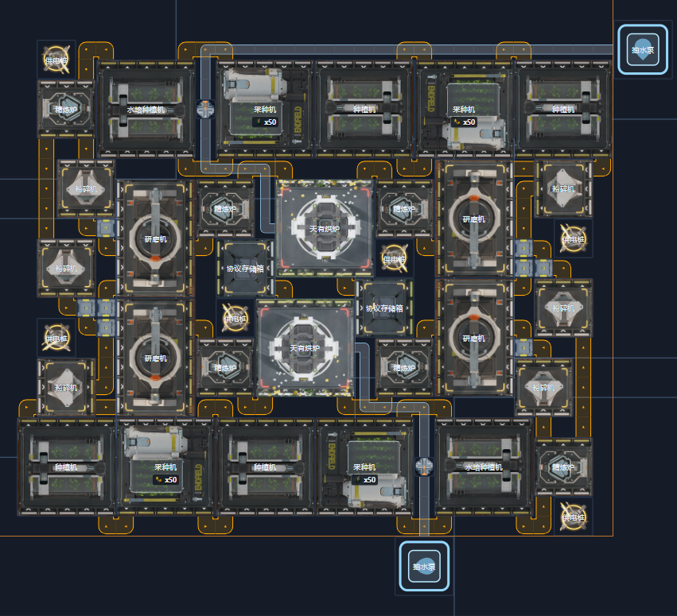
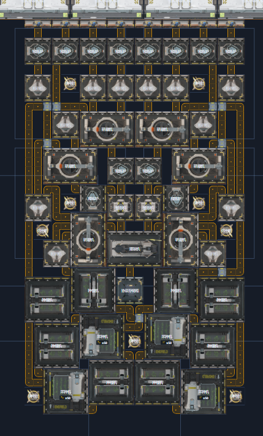

# 【网页仿真】浏览器里运行集成工业 v1.0.5

仿真工具网页链接：  
https://endfield.anonymous-test.top/

---

## 本次更新重点

- 公共蓝图上线
- 电力仿真完整支持
- 产线规划器新增流程图模式

---

## 重要新增功能

### 1. 蓝图区新增「公共蓝图」

内置 2 个蓝图：

- 谷地全速胶囊
- 武陵双息壤

欢迎直接摆下去试试。  
**注：双息壤蓝图需要自行接水。**

---

### 2. 电力系统完整支持（可选真实计算）

右侧可选择：

- 是否启用真实电力计算
- 基地初始电池容量

开始仿真后，右侧顶部会显示当前电力状态。

**说明：**  
当前版本仅对正在编辑的基地进行设备运行与电力仿真（主要用于调试震荡发电 / 布局验证）。

---

### 3. 新增「协议核心」

每个基地会自动放置 1 个协议核心，且不支持删除哟。

---

### 4. 产线规划器新增「流程图」模式

可以像游戏里一样查看整条产线流程。

---

## 其他改动

### 交互体验

- 支持按住 `Shift` 批量摆放多个相同建筑
- 失去焦点后不再自动切换为暂停

### 界面 / 物品

- 物品选择器新增「最近选择的物品」分组
- 预先放入设备的物品现在会在界面上显示
- 统计列表改为按名称排序（不再按产出排序）

### 规则 / 命名

- 调整取货口与存储箱命名，与游戏一致
- 复制 / 蓝图生成的最低建筑上限要求：`2 → 1`
- 解除「天有烘炉」摆放上限，但超过 4 个会提示警告

---

## 已修复的 Bug

- **（严重）修复：** 设备出端口与入端口“贴脸”可直接接通的问题
- 修复：仿真时可以切换基地的问题  
  - 并新增提示：**仿真仅在当前基地运行**
- 修复：蓝铁粉末在产线规划器被识别为基础供给
- 修复：种植机 / 采种机配方显示错误（总显示砂叶）
- 修复：两个不同物品进入同一设备时偶发卡住
- 修复：点选反应池后的图形异常
- 修复：产率统计在非 `1x` 倍率下显示错误
- 修复：设备未运行时随机显示配方的问题

---

## 已知问题（非功能性）

- 产物“每分钟”统计偶尔会出现 `±1` 的跳变

**原因：**  
仿真时间片很细导致统计抖动；但是增大时间片会影响浏览器性能，因此暂无修复计划。

---

## 后续计划

接下来准备迎接游戏 **1.1 版本**！

> 为什么从 1.0.0 跳到 1.0.5 了呀，  
> 因为偷偷发了四个小版本没说。

---