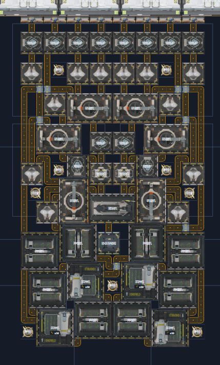

1.0.1 版本更新。

重要新增功能：

1. 在蓝图区新增了“公共蓝图”区域，里面现在自带两个蓝图，一个谷地全速胶囊，一个武陵双息壤。大家可以摆下去试试看。双息壤蓝图需要再自行接水。

2. 电力现在得到了完整的支持，你可以在右侧选择是否真实计算电力。以及基地初始电池容量。

开始仿真后，右侧顶部将会显示当前的电力情况。

不过，当前系统并没有实时运行所有基地，实际上只有你当前正在编辑的基地的设备才会运行，所以这个电力系统其实只是用来方便你调试震荡发电用的.....

3. 加入了大家最喜欢的碍事的协议核心，现在每个基地都会帮大家摆一个而且还不能删除。

4. 产线规划器现在加入了"流程图"模式

可以查看类似游戏里那样的整个流程。

接下来准备迎接游戏的1.1版本！

此外还有如下改动：

调整了取货口和存储箱的名字，改成和游戏一样。
现在可以按住Shift批量摆放多个相同建筑。
为物品选择器加入了“最近选择的物品”分组。
复制和蓝图生成的最低建筑上限要求从2改为1
解除了天有烘炉的摆放上限，但是在摆放超过4个的时候会得到一个提示警告。
预先放入设备的物品现在会在界面上显示
失去焦点后，不会再自动切换为暂停。
统计列表不再按照产出排序，而是按照名称排序。

已修复的Bug：

修复了仿真时可以切换基地的Bug。
现在仿真的时候不许切基地了，并且添加了提示告诉你其实仿真只在当前基地运行。
修复了蓝铁粉末在产线规划器被识别为基础供给的问题。
修复了种植机和采种机不管运行什么配方都显示砂叶的问题。
（严重问题）修复了设备出端口直接对上入端口可以接通的Bug。
修复了设备在没有运行的时候会随机显示一个配方的问题。
修复两个不同物品进入同一个设备时，有时会卡住的问题。
修复了点选反应池后的图形异常。
修复了产率统计在非1x倍率下显示错误的问题。

已知的不算bug的bug：
计算数据时每分钟产物经常出现1个值的跳变。
这是因为仿真循环分时粒度太小导致的，但是加大分时粒度会导致变卡，浏览器就不要苛求太多了。

新版本要来了，其他的Bug来不及修了......
