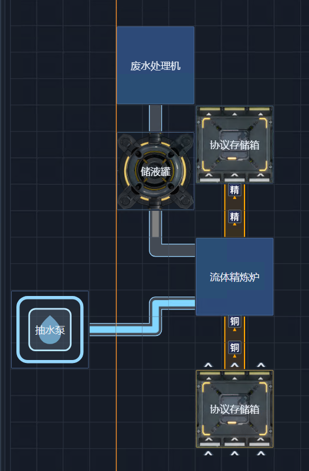
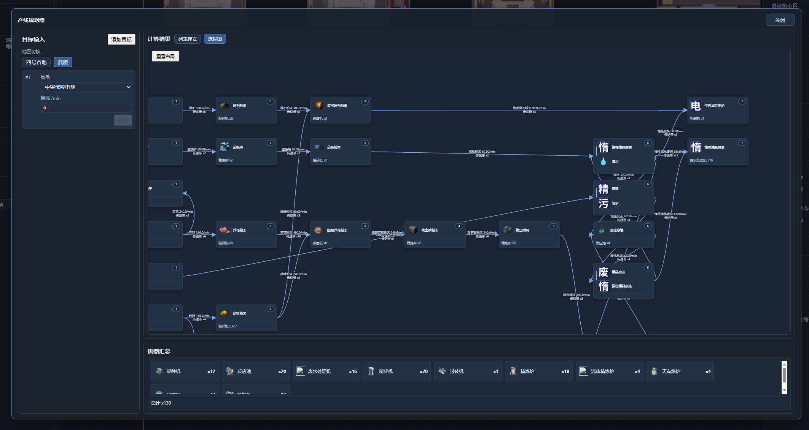
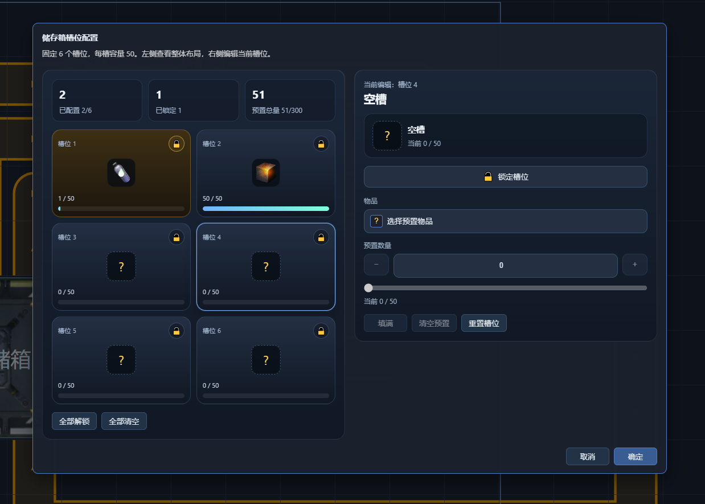
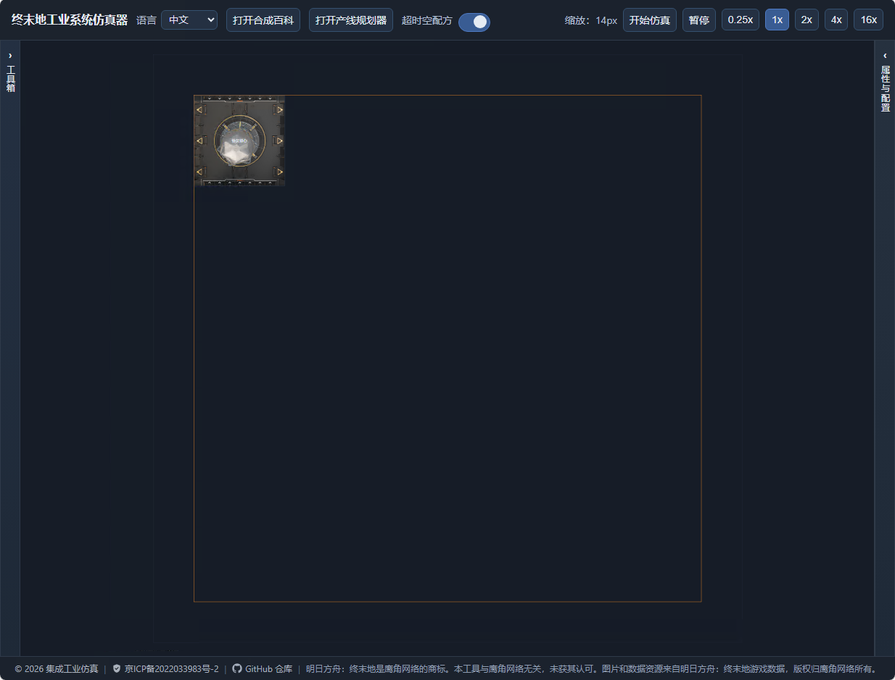

# 【浏览器里的集成工业】来自未来的超时空配方更新 v1.1.0 Beta 

仿真工具网页链接：  
https://endfield.anonymous-test.top/

---

## 本次更新重点

- 新增超时空配方（1.1版本的配方）的提前支持
- 支持自定义物流顺序
- 协议存储箱支持预放置与锁定
- 优化非宽屏显示器下的界面布局

---

## 重要新增功能

### 1. 新增「超时空配方」模式

现在系统中加入了一批 **1.1 版本相关的新物品、新建筑和新配方**。  
在界面左上角勾选 **「启用超时空配方」** 后即可体验。

需要说明的是：

- 这批内容目前还没有正式图标
- 配方信息主要依据 PV 内容推测整理
- 更适合作为提前规划产线的参考工具

所以如果正式上线后发现：

- 建筑规格不同
- 配方内容不同
- 数值与正式版不一致

那就只能以游戏正式版本为准了。

> 这次本来想更早把超时空配方版本发出来，  
> 但前面一直在和 Bug 对线，结果拖到了现在。下次尽量快一点。

---

### 2. 支持「自定义物流顺序」

现在几乎所有带输入输出端口的设备都支持自定义物流优先级，包括：

- 普通生产设备
- 分流器 / 汇流器
- 协议存储箱
- 其他输入输出类设施

配置方式为：**给每个端口指定一个优先级组**。

- 如果两个端口属于同一优先级组，则会轮流输入 / 输出
- 如果优先级组不同，则 **组号更小** 的端口会优先输入 / 输出

如果你不太清楚这个功能是做什么的，也没关系。  
大多数普通产线其实不需要动它；它主要是给 **起死回生机、震荡发电设备** 这类对物流顺序比较敏感的设施准备的。

另外要特别提醒：  
这个功能允许你做出一些 **游戏内未必能原样实现** 的物流效果。

所以如果你是拿它来验证复杂设施，最好还是在游戏里再实际摆一次，确认真实规则下也能正常运行。

补充说明：

- 未做特殊配置的设备，默认仍然是所有端口轮流输入 / 输出
- 做过特殊配置的设备，会显示 **浅绿色边框**，方便识别

---

### 3. 协议存储箱支持「预先放置物品」与「锁定格子」

现在在放置模式下，你可以直接提前为协议存储箱的 6 个格子放入物品。

除此之外，还额外提供了一个游戏内没有的辅助功能：**锁定格子**。

操作方式为：点击格子右上角的锁头图标。锁定后，该格子只会接受对应物品。

这两个功能主要也是为以下场景准备的：

- 起死回生机
- 其他依赖精准物流控制的设施

---

### 4. 优化非宽屏显示器的界面表现

针对非宽屏显示器，调整了左右两侧面板的展示方式。  
现在它们会以 **可收起的抽屉面板** 形式出现，布置产线时会更清爽一些，也更方便腾出可视区域。

---

## 已知问题

目前还缺少一个关键功能：**物品准入口**。  
这个功能对起死回生机尤其重要。

计划在 **1.1.1 正式版** 中补上。

---

## 下个版本预告

下个版本准备继续把和 **1.1 正式环境适配** 相关的内容补齐，当前计划包括：

- 支持在仿真运行时动态调整能耗
- 补上 **物品准入口**
- 提供一个 **起死回生机公共蓝图**
- 增加 **电力 / 电池折线图**，方便观察仿真过程中的变化
- 替换为 **真实 1.1 版本配方和正式图标**

如果中途没有被新的 Bug 拖住的话，下一版应该会更接近真正能拿来直接对照游戏摆设施的状态。