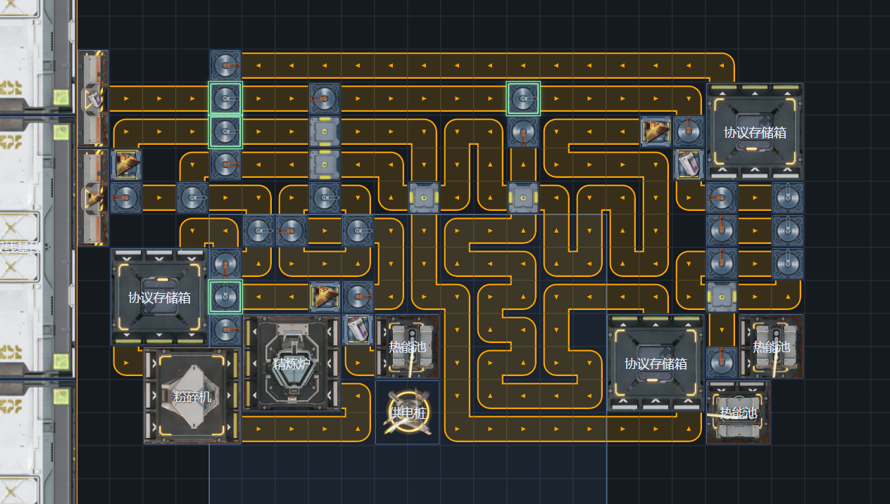
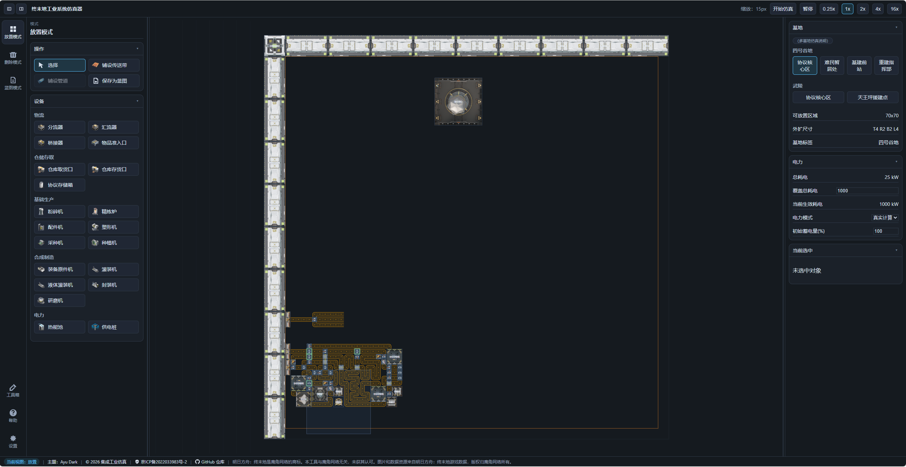
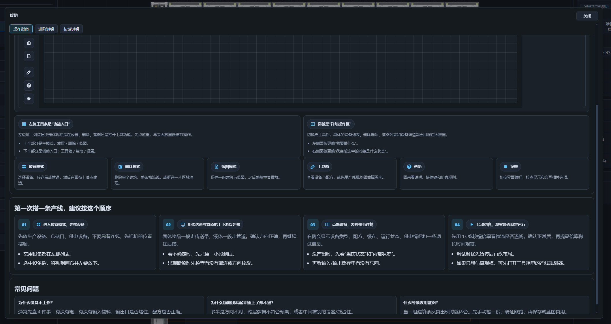
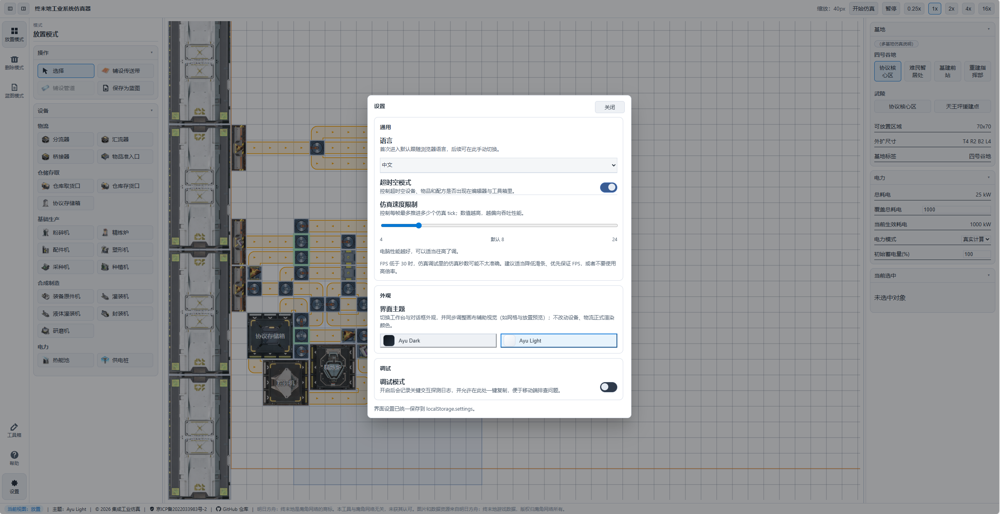

# 【浏览器里的集成工业】正式更新 v1.1.1：这次终于更像一个能长期用的正式版工具了

仿真工具网页链接：  
https://endfield.anonymous-test.top/

---

## 本次更新重点

- 真实 `1.1` 配方与正式图标已全部切换完成
- 新增 **物品准入口**
- 支持 **仿真运行中直接调整总耗电**
- 主界面整体重做，操作更顺手

---

## 1.1 正式配方

本次更新，正式将1.1版本的新物品，新配方加入工具。
原先临时添加的配方已经移除。现在可以快乐的生产废水了。

## 震荡发电

起死回生机的最后一块拼图：物品准入口，已经加入仿真系统。
并且现在可以支持 **仿真运行中直接调整总耗电** 来模拟大停电。
现在可以在这个工具方便的调试震荡发电了。
新版本公共蓝图中新增一张起死回生机7.1蓝图，来自B站大佬 乾震_QzzZ（https://www.bilibili.com/video/BV1v7P4z8EH2），可以在发电量0~1210之间动态调节。

## 重做的界面

新版本完全重构了界面，优化了大量UI和交互逻辑。
原先的配方查询百科和规划器移动到工具箱按钮中。
一些设置移动到了设置按钮中。

不知道如何使用？点击帮助按钮，可以看到完全重做的全新帮助。

（我也有顶栏，底栏，工具栏，左侧栏，右侧栏，我就是VSCode！）
（下个版本把分基地做成tab页！）

此外还更新了浅色模式。

---

## 更新清单

### 新功能

- 切换到真实 `1.1` 配方与正式图标
- 删除旧的「超时空配方」相关内容
- 新增 **物品准入口**
- 支持 **仿真运行中直接调整总耗电**
- 主界面整体重做
- 工具箱 / 帮助 / 设置入口重新整理
- 帮助页重写
- 新增深色 / 浅色主题适配

### 体验优化

- 右侧信息区更清楚
- 常用入口更集中
- 工具箱中的配方信息布局更紧凑
- 帮助内容更适合第一次使用的人阅读
- 浅色主题下的整体阅读体验更好

### 修复与调整

- 端口优先级选择方式优化
- 无限电力模式下的供电范围判断修正
- 协议存储箱在供电范围外的自动提交问题修复
- 右侧详情过长时无法正常查看的问题修复
- 删除模式下的整条删除判定更准确

### 下个版本计划

- 增加 **电力 / 电池折线图**
- 继续做稳定性和常见问题修复
- 音乐播放器