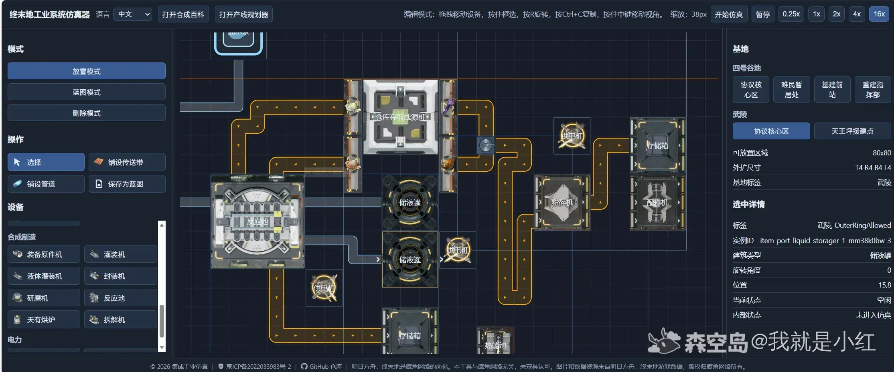
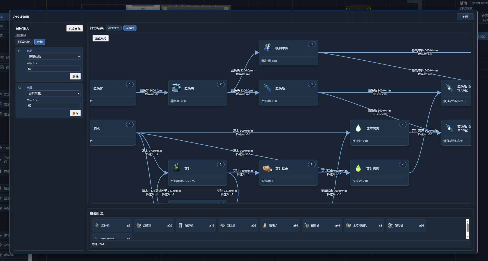
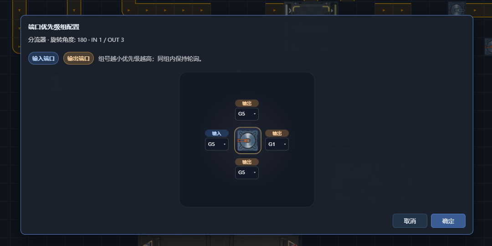

# 工业规划器（IndustrialPlanner）

一个运行在浏览器里的《集成工业》产线布置与仿真工具。  
你可以不用打开游戏，就先在网页里摆产线、接传送带、跑仿真、看统计、查配方、做蓝图，拿它当成 **网页版产线练习场 / 产线验证器** 来用。

在线地址：  
https://endfield.anonymous-test.top/

> 目前主要面向电脑端使用。小屏幕设备暂未做完整适配。



---

## 这是什么？

这是一个基于 React + TypeScript + Vite 开发的纯前端项目，目标是把《集成工业》的产线编辑、物流连接、设备运行与部分电力规则搬到浏览器中。

它更适合以下场景：

- 提前规划一条完整产线
- 验证物流连接是否能跑通
- 调试起死回生机、震荡发电等复杂设施
- 快速查物品 / 建筑 / 配方
- 保存蓝图、复用布局、分享思路

---

## 界面预览

### 产线布置


### 电力仿真


### 流程图规划



### 物流优先级配置



---

## 当前主要功能

### 产线布置

- 支持放置建筑、旋转建筑、移动建筑、删除建筑
- 支持直接铺设传送带，并自动处理部分连接逻辑
- 支持通过“传送带落在传送带上”的方式生成分流 / 汇流结构
- 支持蓝图保存、复制与再次投放
- 支持撤销 / 重做，并可在左侧“操作历史”面板中跳回任一步
- 支持公共蓝图与本地蓝图工作流

### 仿真运行

- 支持启动 / 暂停仿真
- 支持多档倍速运行，最高可用于快速验证产线趋势
- 支持查看设备运行状态、缺料、堵塞、供电等问题
- 支持统计产出、消耗、库存与过程信息

### 电力与复杂设施验证

- 已支持完整电力仿真
- 可选择是否启用真实电力计算
- 可设置基地初始电池容量
- 支持更适合复杂设施调试的物流顺序配置

### 辅助工具

- 内置类似游戏百科的配方查询界面
- 支持查看完整生产链路
- 支持流程图模式查看产线结构
- 支持中英双语与本地持久化
- 操作历史会在刷新后保留；版本升级时会自动清空旧历史，避免兼容错误

---

## 最新版本亮点

### v1.1.0 Beta

- 新增 **超时空配方** 的提前支持，可用于预规划 1.1 内容
- 支持 **自定义物流顺序**
- 协议存储箱支持 **预先放置物品** 与 **锁定格子**
- 优化了非宽屏显示器下的界面布局
- 补上了左侧 **操作历史** 工作区，支持撤销、重做与时间线回跳

> 当前超时空配方主要依据 PV 内容推测整理。  
> 若后续游戏正式版的建筑规格、配方内容、图标或数值发生变化，请以正式实装为准。

### v1.0.5

- 公共蓝图上线
- 电力系统完整支持
- 产线规划器新增流程图模式

---

## 为什么做这个？

因为很多时候：

- 想设计产线，但不想反复开游戏试错
- 想验证一个复杂物流结构，却很难快速定位问题
- 想查配方和链路，但游戏内查看体验不够顺手

所以这个项目希望提供一个更轻量、更直观、也更方便调试的网页环境。

---

## 适合拿来做什么？

- 提前规划新版本产线
- 测试传送带连接与端口优先级
- 验证电力覆盖、供需与运行状态
- 给复杂设施做草稿和预演
- 录图、截图、分享布局思路

---

## 快速开始

### 安装依赖

```bash
npm install
```

### 启动开发环境

```bash
npm run dev
```

### 构建生产版本

```bash
npm run build
```

### 本地预览构建产物

```bash
npm run preview
```

---

## 技术栈

- React
- TypeScript
- Vite
- localStorage（本地持久化）

项目为 **纯前端实现**，无需单独后端即可运行。

---

## 部署说明

项目已配置 GitHub Pages 自动部署。

- 在发布 GitHub Release 时自动构建并部署
- 也支持手动触发工作流

工作流文件： [.github/workflows/deploy-pages.yml](.github/workflows/deploy-pages.yml)

### 发布版本

#### 方式 A：在 GitHub 网页发布 Release

1. 打开仓库的 Releases 页面
2. 点击 Draft a new release
3. 选择或创建标签，例如 `v1.2.0`
4. 填写标题和说明后发布

发布后会自动触发 Pages 部署。

#### 方式 B：命令行发布

```bash
gh release create v1.2.0 \
	--target v2 \
	--title "v1.2.0" \
	--notes "Release v1.2.0"
```

也可以先构建校验后再发布：
```bash
npm run build && gh release create v1.2.0 --target v2 --title "v1.2.0" --notes "Release v1.2.0"
```

### Pages 设置

在仓库设置中确认：

- `Settings -> Pages`
- `Build and deployment -> Source` 选择 `GitHub Actions`

### 自定义域名

当前使用域名：

- `endfield.anonymous-test.top`

仓库内已提供 `public/CNAME`。  
发布后可在 GitHub Pages 设置中确认域名是否生效，并建议开启 HTTPS。

生产环境统计说明：

- Cloudflare Insights beacon 仅在 `anonymous-test.top` 与 `endfield.anonymous-test.top` 域名下动态注入。
- 本地开发、预览环境或其他域名不会加载该脚本，避免无关环境引入额外请求。

---

## 目录结构

```text
.docs/               文档、需求、设计记录、宣传文案
public/              静态资源与公开蓝图
scripts/             资源生成与索引脚本
src/app/             应用级上下文与全局状态
src/domain/          领域模型、设备规则、物流与配方数据
src/features/        各功能域逻辑
src/sim/             仿真引擎与流动逻辑
src/ui/              界面组件、面板、对话框与世界渲染
```

---

## 当前已知说明

- 这是一个不断迭代中的工具，部分功能会先以 Beta 形式上线
- 某些新版本内容可能先基于 PV 或现有资料进行预支持
- 对于涉及复杂物流优先级的设施，网页结果建议最终回到游戏中再次验证

---

## 后续计划

接下来准备继续补齐与 1.1 正式环境适配相关的内容，包括：

- 仿真运行时动态调整能耗
- 物品准入口
- 起死回生机公共蓝图
- 电力与电池折线图
- 真实 1.1 版本配方与正式图标

---

## 反馈方式

如果你遇到问题，或者发现某些设备 / 配方 / 物流行为和游戏表现不一致，欢迎：

- 提交 GitHub Issue
- 在发布帖或动态下留言反馈

---

## 许可证

当前仓库尚未单独声明开源许可证。  
如果需要对外分发、复用或进行二次发布，建议先补充明确的许可证策略。
