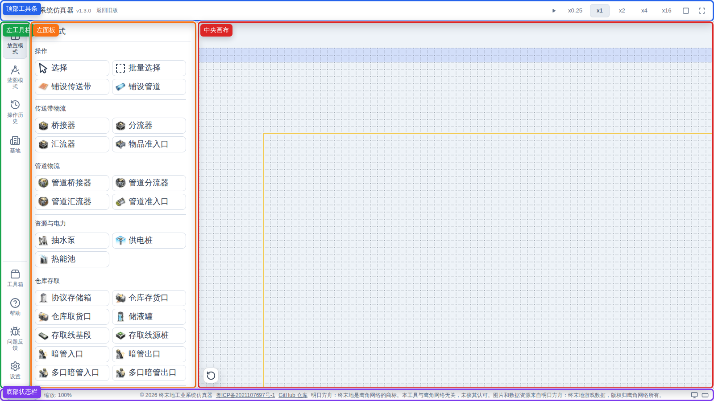

# 工业规划器（IndustrialPlanner）

一个运行在浏览器里的《集成工业》产线布置与仿真工具。

你可以不用打开游戏，就先在网页里摆产线、接传送带、配物流、跑仿真、查配方、做蓝图，把它当成网页版产线练习场、验证器和草稿本来用。

## 在线使用

- 国际站：https://endfield.anonymous-test.top/
- 中国大陆 CDN：https://endfield.amiyabot.com/

> 当前仍然更适合电脑端使用。触控支持和竖屏适配仍在继续补强，小屏幕设备体验可能不完整。

## 这个工具能做什么

- 提前规划一整条产线，不用反复进游戏试错。
- 验证传送带、管道、分流汇流和端口配置是否能跑通。
- 用仿真快速定位缺料、堵塞、供电不足和节拍问题。
- 查物品、建筑、配方和生产链路。
- 保存蓝图、复用布局、分享方案。（非游戏内可用的蓝图）
- **此外大多数工具都有的Wiki查询，产线规划流程图等功能我们也有。**

## 相比于游戏内的优势

- 可以虚空生产物品，尤其是流体
抽水泵，暗管出口两个设备，在这里可以选择无限虚空生产液体，不只是清水。出货口可以无视库存限制，直接取出物品。
- 设备内预制的物品也可以保存在蓝图里
忘记了这个蓝图哪个放砂叶哪个放荞花？复制设备和蓝图的时候也会一同复制设备里塞进去的物品。
- 可以临时重叠放置建筑
修改产线的时候，建筑想移动位置却发现没地方，只能先收纳？在这里你可以把建筑叠放到一起，调整好位置以后再分开。
- 可以最高16倍速模拟
- 可以随时调整耗电量，可以随时模拟电力不足
震荡发电需要一小时才能激活？现在只需要几分钟就能看到效果了。（当然大部分电脑可能最高只能跑到4倍，但是那也很快了）
需要摆很多设备模拟停电？现在只用一键。

## 当前主要功能

### 产线编辑

- 支持放置、旋转、移动、框选和删除建筑。
- 支持直接铺设传送带与管道，并自动处理部分连接逻辑。
- 支持通过传送带叠放快速生成分流、汇流等结构。
- 支持多基地切换和不同基地规格下的布局规划。
- 支持流程图模式查看产线结构。

### 蓝图工作流

- 支持保存正式蓝图、复制临时蓝图并再次投放。
- 支持公共蓝图、本地蓝图和最近一次临时蓝图恢复。
- 支持蓝图分享与复用，适合记录标准化模块。
- 支持协议核心随蓝图处理，并在正式放置前做必要确认。
- 保存正式蓝图时会剔除建造区域外设备，避免保存出不可用内容。

### 仿真与调试

- 支持开始、暂停和退出仿真。
- 支持多档速度，适合快速验证产线趋势。
- 支持查看设备运行状态、缺料、堵塞、内部缓存和运行结果。
- 支持统计产出、消耗、库存与过程信息。
- 当前仿真默认只完整计算当前活动基地，跨基地流程更适合作为近似规划参考。

### 电力与复杂设施

- 支持完整电力仿真。
- 可切换真实供电或无限供电模式。
- 可设置基地初始电池百分比。
- 支持更细的物流顺序与端口优先级配置。
- 支持协议存储箱预置物品、锁定格子等更接近实战的配置方式。

### 历史与持久化

- 支持撤销、重做。
- 左侧操作历史面板支持时间线回跳。
- 刷新页面后仍会保留当前基地的操作历史。
- 版本升级时会自动丢弃旧历史，避免兼容错误。

### 辅助工具

- 内置配方查询与生产链路浏览。
- 提供帮助面板，方便快速回看操作说明和仿真规则。
- 支持中英双语。
- 多数常用设置和本地内容会自动持久化。

## 适合用来验证的场景

- 新版本产线预规划。
- 复杂物流结构的联通性检查。
- 电力覆盖、供需与电池策略验证。
- 协议核心、优先级端口、预置物品等复杂设施调试。
- 做攻略配图、录图、截图和分享布局思路。

## 当前说明

- 这是一个持续迭代中的工具，部分内容会先以 Beta 形式上线。
- 某些新版本配方、建筑或图标可能会先依据现有资料做预支持，正式版如有变化，请以游戏实装为准。
- 涉及非常复杂的物流优先级、极端吞吐或跨基地联动时，网页结果仍建议回到游戏内做最终确认。

## 反馈

如果你发现某些设备、配方、物流或仿真结果与游戏表现不一致，可以通过 GitHub Issue 或相关发布帖反馈。

## 许可证

本项目采用 MIT License，详见 [LICENSE](LICENSE)。
