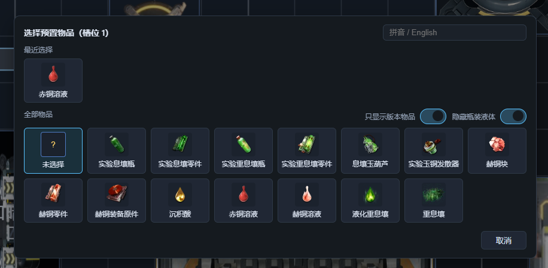
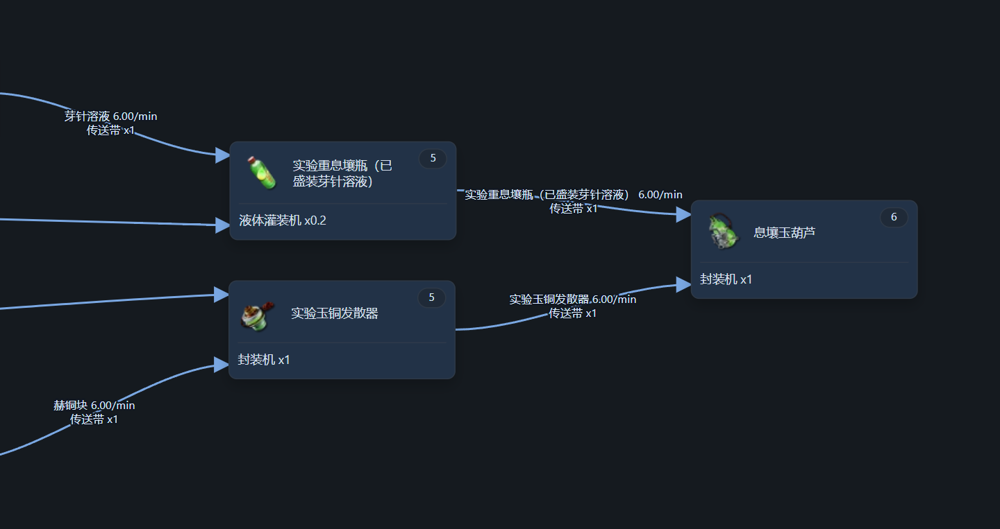
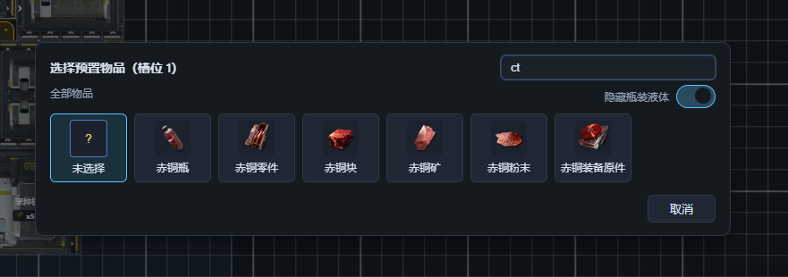

# 【浏览器里的集成工业】春晓时。正式更新 v1.2.0

本次更新重点

- 加入 1.2 配方，物品与设备
- 提前加入了还没开放的版本活动需要生产的物品
- 选择物品时支持搜索
- 修复了大量Bug
- 更换了一种全新的更贴近终末地本体的仿真运行规则
- 新基地：心脏修缮站
- 加入了一张中容武陵电池的蓝图

仿真工具网页链接：  

（目前版本在移动端竖屏排版有些问题，建议使用电脑访问）

[国内]

https://endfield.amiyabot.com/

[国外] 

https://endfield.anonymous-test.top/ 

---

本次更新在表面上看起来内容不多，只包含两个大的内容。

1.2 正式配方

这次吸取了上次的教训，提前加入的配方和设备有错误，又一直没有发现，导致多个版本内一直使用错误配方。
这次学乖了，等到游戏更新后，再根据游戏内容加入配方，保证不会出现问题。

新增的基础物品 14 个：赫铜块、沉积酸、赤铜溶液、赫铜溶液、液化重息壤、实验息壤零件、实验重息壤零件、实验息壤瓶、实验重息壤瓶、实验玉铜发散器、息壤玉葫芦、赫铜零件、赫铜装备原件、重息壤。
以及42种全新的瓶装液体物品组合。

直接新增配方 21 条。
配件机，10s：赫铜块 x5 -> 赫铜零件 x1。
配件机，2s：息壤 x1 -> 实验息壤零件 x1。
配件机，20s：重息壤 x1 -> 实验重息壤零件 x2。
封装机，10s：实验重息壤零件 x1 + 赫铜块 x1 -> 实验玉铜发散器 x1。
封装机，10s：实验重息壤瓶（已盛装芽针溶液） x1 + 实验玉铜发散器 x1 -> 息壤玉葫芦 x1。
装备原件机，10s：赫铜零件 x2 + 重息壤 x2 -> 赫铜装备原件 x1。
塑形机，2s：息壤 x2 -> 实验息壤瓶 x1。
塑形机，20s：重息壤 x1 -> 实验重息壤瓶 x2。
反应池/扩容反应池，2s：重息壤 x1 + 沉积酸 x1 -> 液化重息壤 x1。
反应池/扩容反应池，2s：赤铜粉末 x1 + 沉积酸 x1 -> 赤铜溶液 x1。
反应池/扩容反应池，2s：赫铜溶液 x2 + 蓝铁粉末 x1 -> 赫铜块 x1 + 污水 x1。
提纯机，2s：惰性壤晶废液 x4 -> 清水 x1 + 壤晶废液 x1。
提纯机，2s：赤铜溶液 x4 -> 沉积酸 x1 + 赫铜溶液 x1。
以及42个拆解机配方和42个灌装机配方。

新增4个设备。多口暗管入口，多口暗管出口，扩容反应池，提纯机

还未开放的版本活动

新版本下半段会开放一个活动，活动中会出现一些临时生产配方，需要去生产该配方并兑换活动代币。
现在仿真系统中就已经存在这些配方和物品了，你现在就可以尝试搭建产线生产他们。

搜索物品

因为终末地的物品实在太多，现在物品选择弹框加入了物品搜索功能。
现在你可以按照文本，拼音，拼音首字母，（以及物品id）匹配搜索物品。
此外现在物品排序方式改为按照id排序，这样同类物品会天然放在附近，方便查找。

此外还新增了一个“版本物品”筛选项来筛选本次新添加的物品。
现在可以保存“隐藏瓶装液体”筛选框的选择状态了。

调整仿真运行规则

这次更新，更换了一种全新的更贴近终末地本体的仿真运行规则。未来我希望这个规则可以解决终末地大量基于“放置先后顺序”产生的行为问题。但是目前因为缺乏调试，暂时屏蔽了里面一些更激进的调整，让它看起来和老的仿真规则更为接近。

如果遇到新的仿真问题，请一定要反馈，不管是在Github还是在评论区。

修复了大量Bug

这次更新，距离上次更新也过了很多版本，中间修复了大量bug。
包括
- 配方错误
- 反应池一段时间后可能会突然不工作
- 废水处理机无法工作
- 水管不能跨越基段
- 有时协议核心无法正常输出物品
- 修复了刷新页面后仍然拿着未放置的设备的问题
- 以及大量影响仿真运行的bug

---
当前版本添加的新物品和新配方。

---

下个版本预告

目前v3版本正在锐意开发中，这次的v3版本不仅增加了对移动端的支持，还更换了更高效的WebGL绘图方式，让仿真更流畅，人人都能开x16。
不过新版本开发可能会需要很长时间，估计得离开武陵才能看到了。
在新版本开发期间，当前版本仍然会继续维护，增加配方，修复bug。只不过暂时不会再增加新功能。