# 【浏览器里的集成工业】寻遗散记，全新 v3 正式版！

xdm，久等了！

距离上次更新已经过去了好久，这是因为，以前用AI糊的代码，移动端适配和性能调优实在是太难了，因此为了适配移动端，**整个工具从底层到界面，完全重写。**

---

## ⚠️ 你的数据没丢！左上角可以回旧版

**v2 的所有数据都还在！**

点击页面左上角的 **「返回旧版」** 的链接就能回到v2。

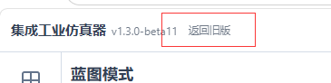

新旧两版数据独立存储，互不干扰。v3 第一次打开会自动问你要不要迁移 v2 数据过来，你也可以随时手动迁移。迁移不会删除 v2 的原始数据。

---

## 🔥 一、移动端终于能用了！

现在 v3 从头设计了三端自适应的布局：

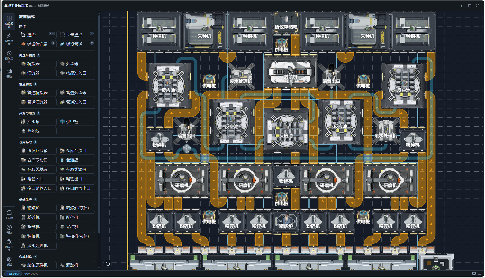

桌面端

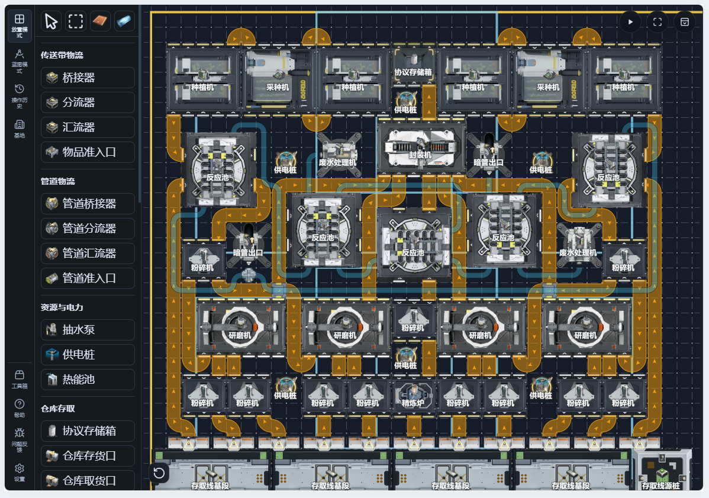

平板端

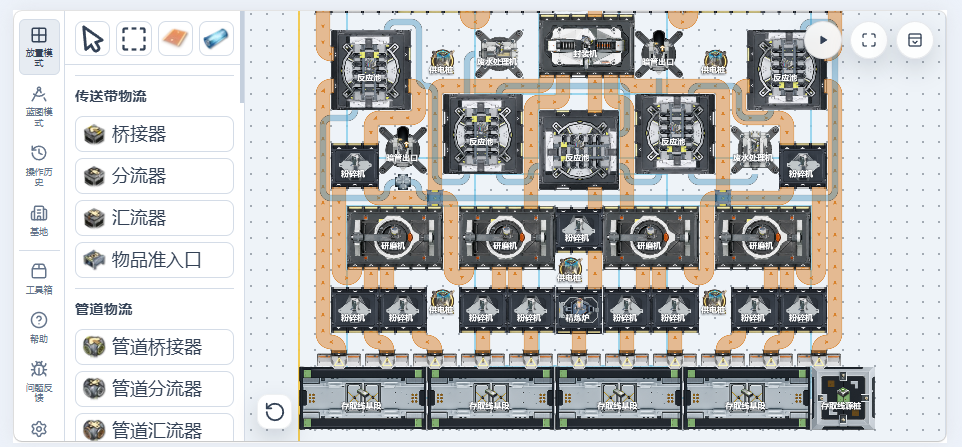

移动端

终于，手机也能愉快地摆设备了。

---

## 🎨 二、蓝图风格界面

有朋友表示喜欢蓝图那种干净利落的风格，于是我们加了个开关。

在设置里打开 **「使用蓝图样式的设备图片」**，所有设备的贴图都会变成蓝图线条风格。不影响任何功能，纯视觉切换。

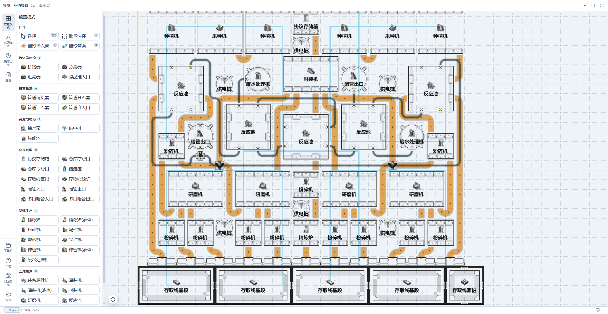

---

## 🕹️ 三、更丰富的选项，操作模式大改，现在跟游戏完全一致了

之前的版本为了"方便写代码"，加了不少和游戏本体不一样的操作逻辑。结果就是：玩完工具再玩游戏，肌肉记忆打架。

现在 v3 的默认操作**完全复刻游戏本体**。拖拽、选择、旋转、放置，一切跟你在游戏里的逻辑完全一样。

那以前的"便捷功能"呢？都还在，只是变成了**可单独开启的选项**。你可以在设置里一个个打开自己需要的：

- 连续放置模式
- 快速旋转
- 立即拖拽
- ……等各种便捷操作

想跟游戏一样就全关，想怎么方便就怎么来。

我建议您探索一下**操作**选项组下面的各个选项，他们每一个都提供了一个我亲测会更方便的增强功能，不过为了保证和游戏内操作一致，因此大部分默认关闭。部分选项带有帮助按钮,可以查看详细的说明。

v3 的设置面板可以说是重新做了一遍。除了上面说的操作模式，还有：

- 传送带/管道的显示与隐藏
- 浅色/深色主题
- 蓝图风格切换

以及

快捷键配置！

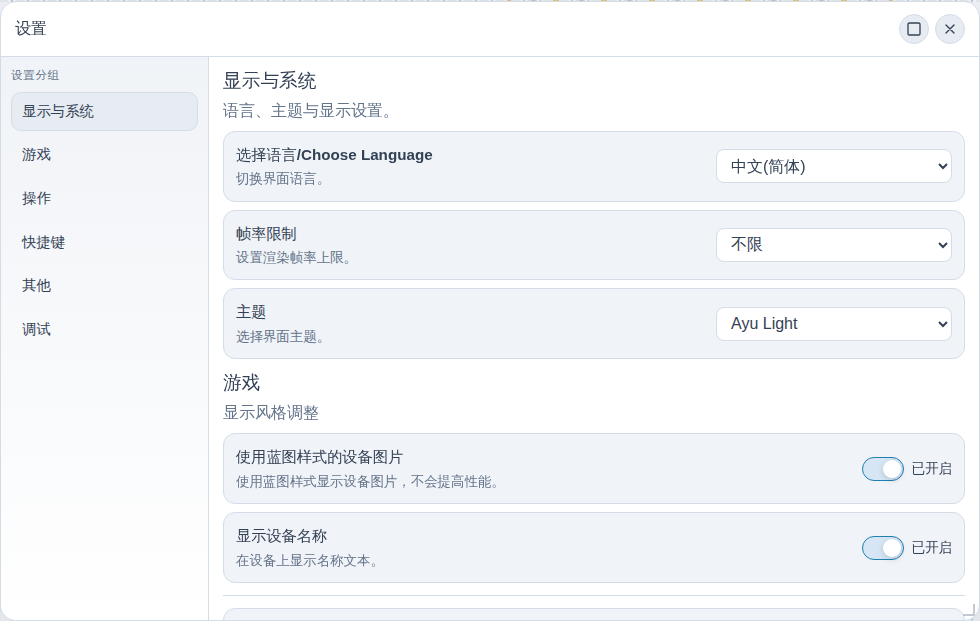

---

## ⚙️ 四、性能优化

新版本极大地优化了性能，尤其是移动端。
并且还引入了动态tick rate和动态帧率。
现在几乎在所有设备上，都能稳定在30帧并且开启16倍速了。

---

## 🧮 五、全新工具箱：模块配平

这是一个偷偷加入但是没有介绍过的全新功能。

大多数配平工具只能使用系统配方来配平，但是我们这个工具可以使用自定义模块进行配平。
你可以把一堆生产配方丢进去，它会自动算出每个阶段的物品净差值。然后，你可以把他保存为一个新的模块。

这样，你就可以把你的模块化产线引入配平工具进行配平，可以确认某个版本或者在你当前资源产率下，各个模块的组合数量。

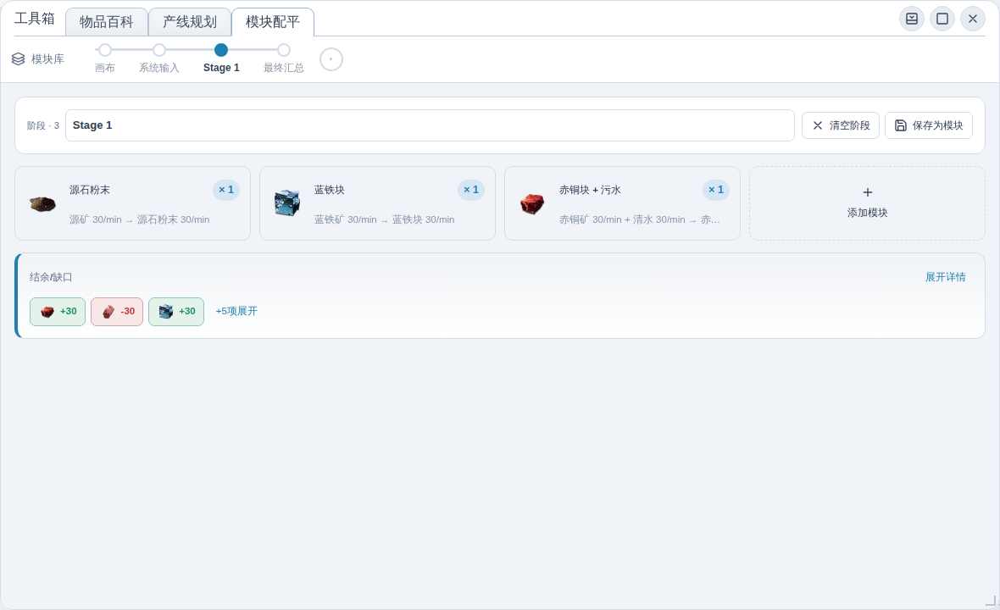

---

## 📡 六、离线模式，断网也能用

离线模式正式上线。

现在网站会自动把所有资源缓存到本地，之后就算你在高铁上、在山区里、在信号一格的角落，都能正常打开使用全部功能。

---

## 🔮 七、提前实装的下版本功能

我提前把游戏下个版本才会实装的一个内容做进来了：

**Tab 切换液体变体**：选中一个有液体变体的设备（比如种植机），按下 Tab 键，直接切换成液体版本。再也不用删掉重建了。

---

## 📚 八、全新百科

百科工具完全重做了。

现在它像真正的维基一样支持：
- **点击跳转**：看到物品名字就点，直接跳转到它的详情页
- **面包屑导航**：知道自己从哪来的，随时回到上一级
- **分类浏览**：物品、设备、配方三大入口，按需查找
- **搜索**：支持文字、拼音、拼音首字母搜索
- **配方关联**：点一个物品，直接看到它参与的所有配方（作为输入、输出、液体填充、拆解）

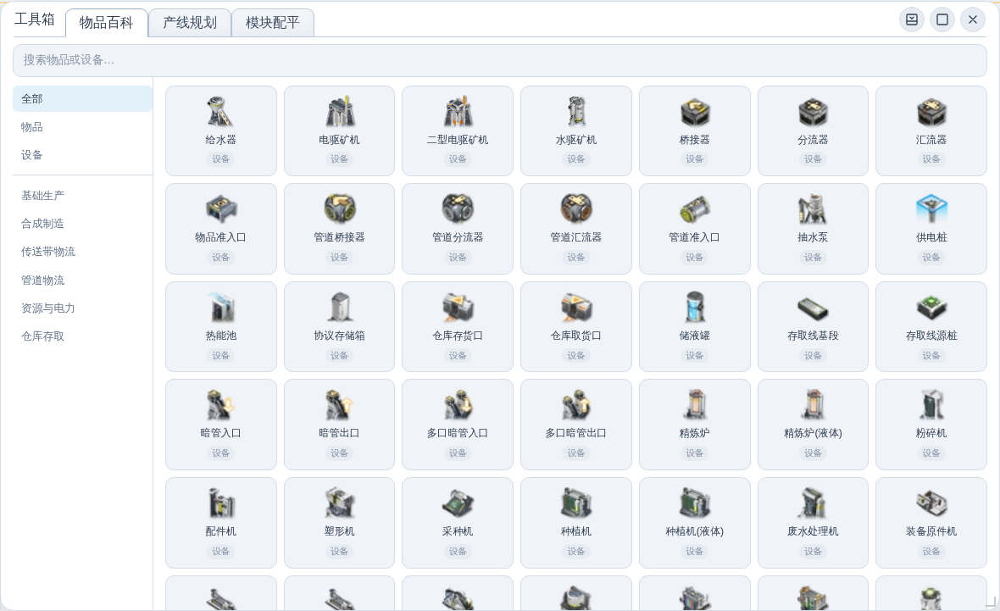

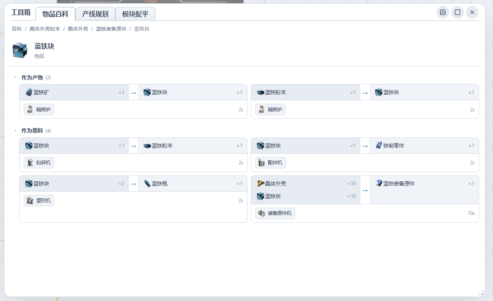

---

## 🏭 九、全新产线规划器

产线规划器也重写了。

设定你要产出的物品和速率，设定外部供应的物品，它自动算出需要多少台什么设备、需要多少原料速率。

支持多种来源策略（水/酸/污水的处理方式），结果可以按物品视图或设备视图查看，还有流程图模式。

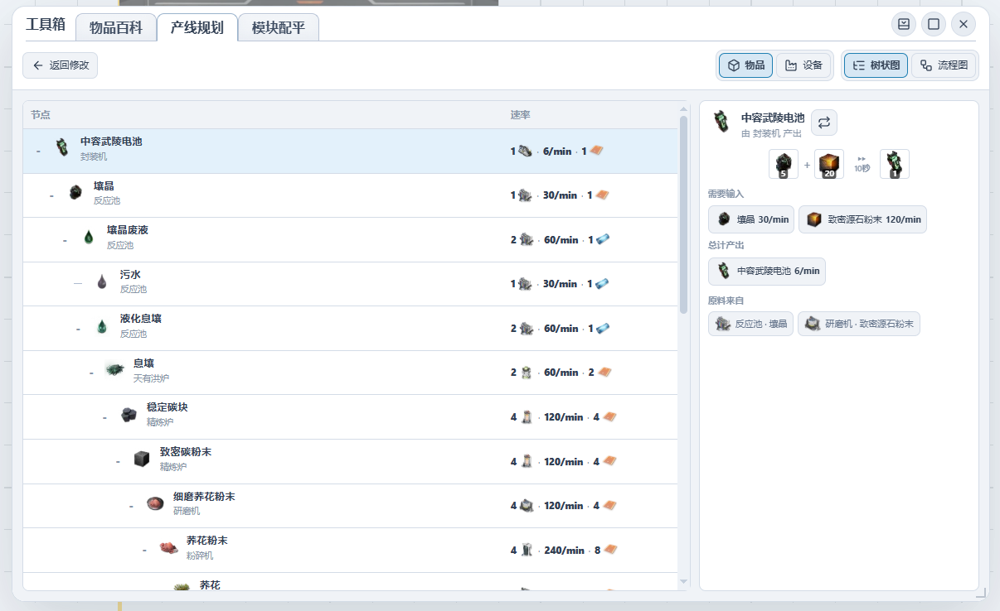

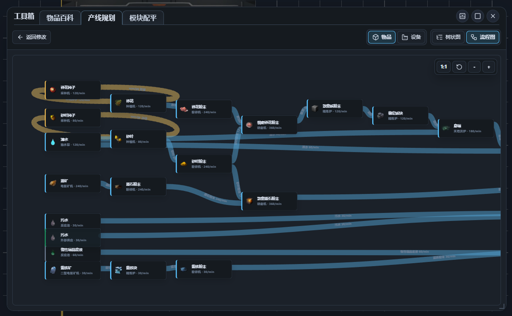
---

## 📦 十、关于数据迁移

首次打开 v3 会自动检测你的 v2 数据，弹窗问你要不要迁移。

迁移内容包括：
- v2 的地图 → v3 的地图
- v2 的蓝图 → v3 蓝图库的「迁移的蓝图」文件夹
- v2 的模块配平 → v3 模块配平

**迁移不会删除 v2 的任何数据。** 你随时可以点左上角「返回旧版」回去接着用。

---

### 如果迁移出问题了怎么办？

手动迁移的步骤：

1. 打开 v2（点左上角「返回旧版」）
2. 导出你想迁移的蓝图（在蓝图面板里一个个导出）
3. 回到 v3，在蓝图面板里导入刚才导出的文件
4. 地图数据目前需要手动重建（楼主在想办法做更好的迁移方案）

---

## 🔗 链接

[国内]
https://endfield.amiyabot.com/

[国外]
https://endfield.anonymous-test.top/

---

## 💬 最后

这次更新改动非常巨大，也经过了好多天的测试，但仍然可能存在一些 bug 或者不够完善的地方。

如果遇到 bug 或者有什么想法，欢迎在评论区或者 GitHub Issues 提出来。
