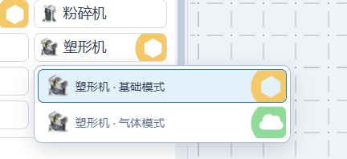
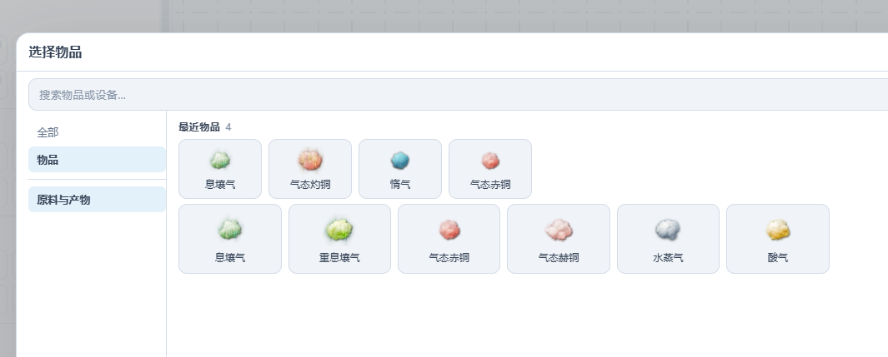
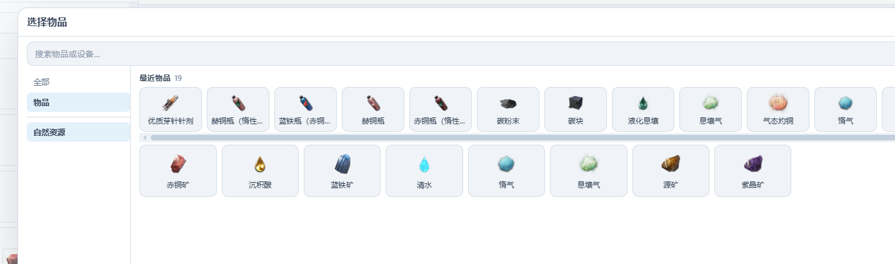

## 新增折叠设备模式

具有多种模式的设备现在只会显示一个按钮（该选项可在设置中关闭）：
- PC 端悬浮在按钮上时显示模式菜单
- 移动端长按按钮弹出模式菜单
- 也可以点击尾部的模式图标弹出菜单

最后一次使用的模式将成为按钮直接按下的模式。

> 图：折叠后的设备模式按钮及弹出菜单

## 物品选择器新增多种筛选

在设备的槽位编辑器中选择物品时，新增「原料与产物」筛选项，选择后将显示该设备所有可运行配方的原料与产物。

> 图：物品选择器中新增的原料与产物筛选

在模块配平模式的系统输入中新增输入项时，新增「自然资源」筛选项，选择后将显示可自然采集的矿产。

> 图：物品选择器中新增的自然资源筛选

## 其他改动

- PC 端模块配平面板改为侧栏布局
- 对模块配平页面进行了美化
- 模块均衡面板新增空状态引导，当所有画布均含未启用活动时提示用户
- PC 端模块配平的「添加到阶段」按钮支持在无阶段时自动展开模块库并高亮引导
