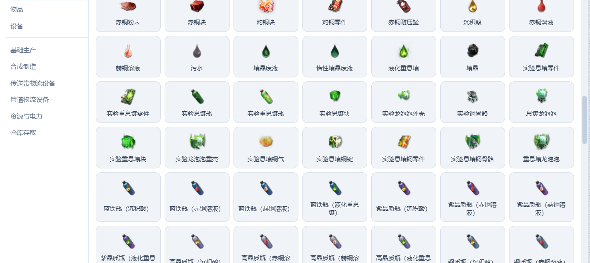
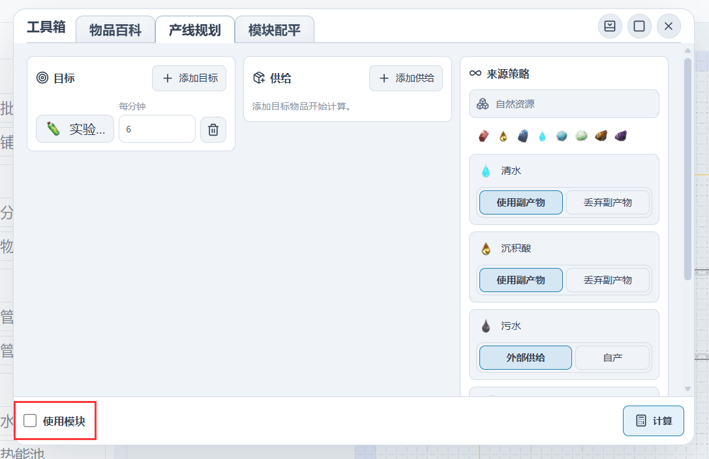

# 【浏览器里的集成工业】雪凇幽梦 正式更新 v1.5.0

大家好！呼呼呼！新版本解锁新地图的新矿点了吗？

本次更新带来了还未开放的全新活动的配方数据：

## 新增“集成援助·泡泡出击”

新增限时活动“集成援助·泡泡出击”的生产内容，包括 11 种活动物品及对应的完整生产配方，可以直接用于产线规划、模块配平和基地仿真。

- 活动时间为 2026 年 9 月 16 日 12:00 至 9 月 30 日 16:00。
- 数据来自 [AKEData ](https://www.akedata.wiki/) ，感谢AKEData。

## 产线规划支持模块求解

产线规划现在可以直接使用模块配平中的模块参与求解。开启“使用模块”后，自定义模块和推荐模块会与普通配方一起成为生产候选，由规划器根据目标产量统一计算。

## 快速放置支持纯键盘操作

通过快捷键打开快速放置后，搜索框会自动获得焦点，可以直接输入设备名称并继续使用键盘完成选择。

-也就是说，现在依次按下 Z C Z J 下 回车，即可快速放置采种机。
- 使用方向键上、下切换搜索结果，按 Enter 确认放置。
- 使用数字键快速选择收藏位中的设备。
- 按 Escape 关闭快速放置并返回画布。

## 设备名称修正

- 将“协议存储箱”修正为“协议储存箱”。
- 将“抽水泵”修正为“水泵”。
- 批量校正英文环境中的设备名称，使其与游戏数据中的正式名称保持一致。

## 💬 最后

如果遇到 bug 或者有什么想法，欢迎在评论区或者 GitHub Issues 提出来。
