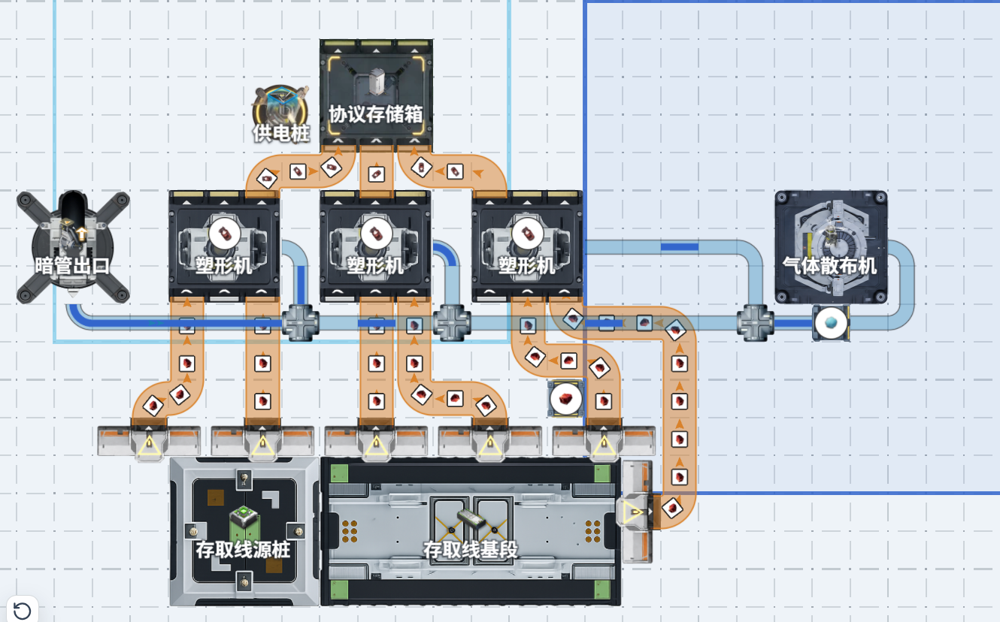

- **设置新增「显示管道具体物流情况」选项，开启后精确显示管道内物品所在位置**
这个机制和游戏内是一致的。游戏内管道虽然显示上连续，实际上和传送带一样也是离散运输，开启这个选项可以看到具体的离散运输情况。
当你发现流体经过多层管道分流器后末端设备无法满速的时候，你可以打开该功能理解这个现象。

- **修复了一处严重的管道物流通过分流器时，每个口最大速度可能会降速到30，和游戏内不符的问题**
- 产线规划新增工序图视图模式，极为类似游戏本体中的查看链路。
- 基地面板新增问题诊断功能，列出当前蓝图中的配置问题，点击可聚焦到对应设备
- 修复旋转视图后鼠标下的设备高亮框不跟随旋转的问题
- 在3D俯视图模式下，为生产设备流体端口添加管道连接提示标识
- 进行了一些更贴合游戏的底层架构重构
- 模块配平功能的模块库和画布库现在支持文件夹结构
- 设置新增「实验性功能」开关，可启用一些不保证能用的实验性特性
- 实验性功能：新增WebDAV远程同步，但是因为坚果云等大部分网盘不支持CORS，所以并不能用他们来同步。
- 实验性功能：新增虚拟鼠标指针设置，可以显示一个假的鼠标指针，但是会让鼠标变的很卡。