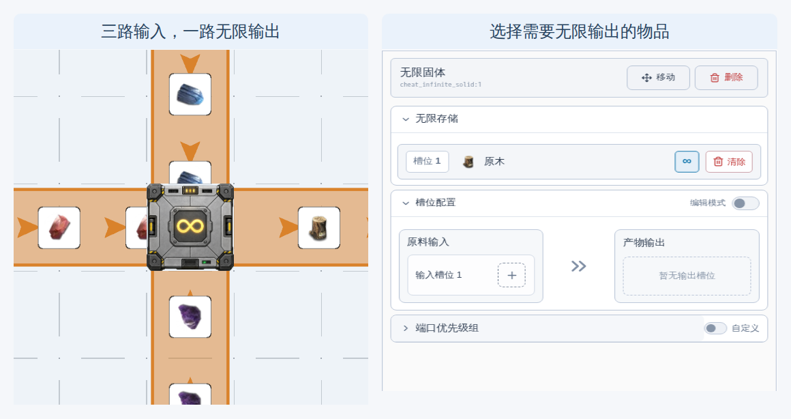
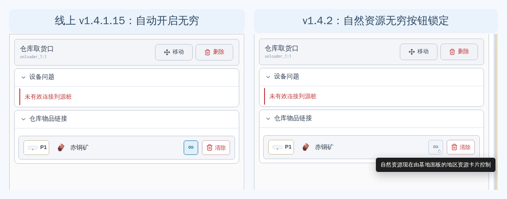
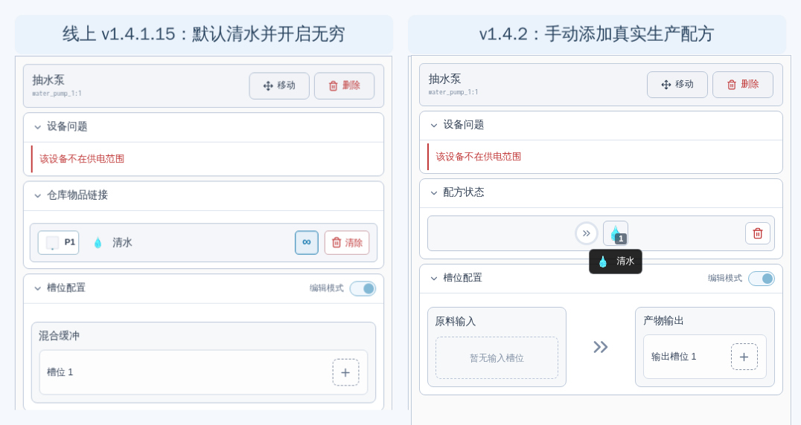
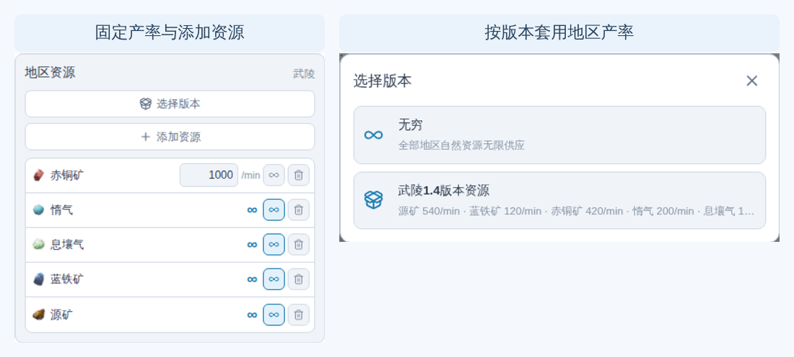
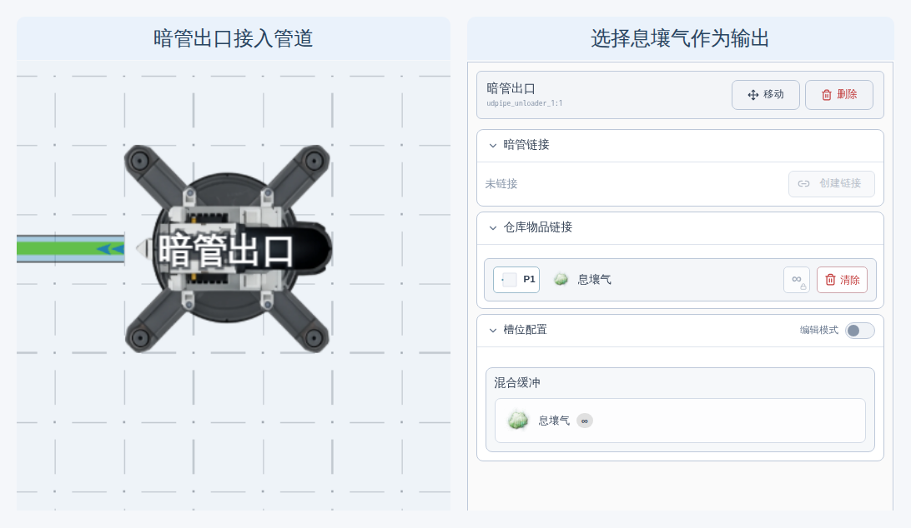
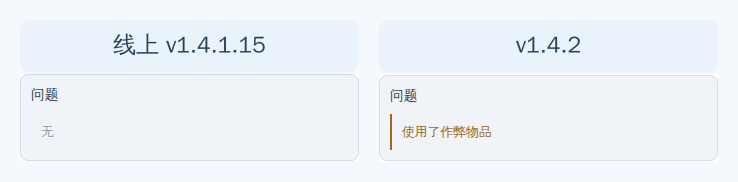

## 作弊功能

- 新增三个作弊工具，提供无限液体，气体和固体。

> 图：放置模式新增无限固体、无限液体和无限气体三种作弊设备。

- 这三个工具的四个方向均可接受输入和输出，但是只接受对应类型的物品，输入会销毁每个收到的任意符合类型的物品。输出则会无限输出你所选择的物品。

> 图：作弊设备支持四向连接，并可在设备属性中选择需要无限输出的物品。

## 真实地区资源配置

在过去，无限提供矿物和流体是通过在仓库取货口和抽水泵等设备上配置对应物品并点击无限按钮实现的。为了方便配置，选择矿物或者清水等时还会自动帮你点击无限按钮。

现在，仓库取货口，未链接的暗管出口等设备，在选择物品后，如果物品是自然资源，现在无穷按钮会被锁定，不再允许按下。

> 图：旧版会为自然资源自动开启无穷；新版改由地区资源统一控制，并锁定设备上的无穷按钮。

气体收集泵和抽水泵，现在改为需要手动选择配方。

> 图：旧版抽水泵默认提供无限清水；新版需要手动添加清水或沉积酸生产配方，气体收集泵同理。

（旧蓝图会自动迁移，如果你过去选择的是清水，沉积酸，惰气或者息壤气，会自动帮你选择配方。否则会为你替换为作弊设备）

现在，想要提供无限的矿物资源，需要在基地面板新增的 地区资源 卡片中配置，默认为全无穷。
你可以将其修改为一个固定数值，或者直接按照版本选择输出。

> 图：地区资源既可以逐项设置固定产率，也可以直接套用当前版本的地区资源产率。

此时基地将会按照这个产率产出自然资源。
在这里设置回默认的全无穷，就可以用于模拟无限矿物。

我们推荐你不要再使用气体收集泵这个设备，而是使用暗管出口，并选择息壤气或者惰气来模拟从其他地图拉来此气体，并调整地区资源来提供有限或者无限的气体。

> 图：在暗管出口选择息壤气，再通过地区资源控制其有限或无限供应。

## 新的问题面板

在过去，我们在基地面板增加了问题卡片，用于展示一些放置错误。
本次更新我们新增了更多可展示的作弊问题。

> 图：相同的作弊设备配置在旧版中不产生提示，新版会显示“使用了作弊物品”。

一旦你开启了某个作弊设置（游戏中无法复刻），则会展示作弊提示。
不过仅仅是提示，并不影响实际运行。点击问题条目会聚焦到该设备。

## 其他改动

- 新增实验性“允许多个基地同时运行”功能，启用后会同步运行同一地区的全部基地，并共享地区仓库（该功能还在测试，注意可能会导致存档错乱）
- 优化物流端口提示，同一物理端口不再同时显示重复或冲突的箭头与叉号
- 供电桩和气体扩散机放置和移动时会和游戏里一样高亮相关设备
- 修复缩放画布时，传送带上的货物框比例异常的问题
- 修复配方物品提示框可能被面板裁切或撑宽检查器的问题
- 修复了蓝铁块配方在产线规划中的错误
- 为物品准入口增加了所选物品的图标
- 修复了移动端旋转基地后，工具条漂移的问题
