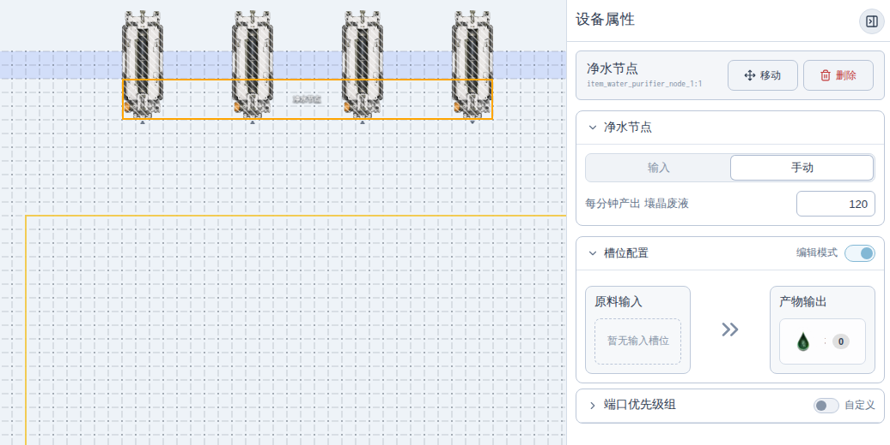
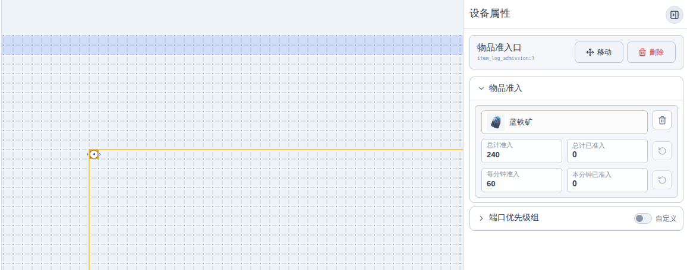
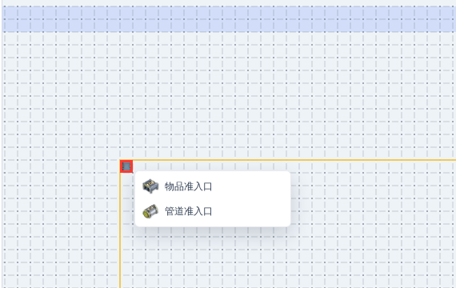

# 【浏览器里的集成工业】向渊行 正式更新 v1.4.0

## 一、素材更新

本次更新替换和调整了一批素材，包括部分设备在蓝图模式下的设备图、设备图标，以及协议核心图标。
（笨笨鹰角上个版本蓝图模式下用错了暗管出入口的底图，这个版本修复了，因此我们也跟着修复）

## 二、新增净水节点

应部分管理员反馈，本次新增 **净水节点**。

净水节点会吸附在地图边缘。默认模式下，它按照游戏内的换算关系运行：**30 点污水转化为 1 点壤晶废液**。

如果需要模拟其他地图、其他产线向当前地图提交污水，也可以切到 **手动** 模式，直接填写每分钟产出的壤晶废液数量。这个模式只看你填的产出速率，不再按收到的污水数量换算。

> 图：净水节点贴在地图外环，右侧属性面板切到“手动”后，可以直接指定每分钟产出的壤晶废液。

此外，抽水泵现在也改为边缘吸附。旧产线里如果有摆在普通位置的抽水泵，可以改用暗管出口，并指定无限生产清水。

## 三、向渊行工业系统更新

本次更新了向渊行版本的工业系统内容。

新设备:

新物品:

新配方：

## 四、准入口控速

准入口新增 **每分钟准入上限**。

跟随游戏更新，现在可以限制每分钟最多流过多少。

物品准入口和管道准入口都支持这个规则。设置物品后，可以分别填写 **总计准入** 和 **每分钟准入**。

> 图：物品准入口选定物品后，可以同时设置总计准入和每分钟准入，右侧面板会显示对应计数。

## 五、重叠设备菜单

现在点击重叠设备所在的格子时，会弹出设备选择菜单。

> 图：同一格里存在多个设备时，点击后会显示候选设备列表，选择目标后再继续操作。

## 六、移动端操作优化

移动端放置设备和蓝图时，如果拖动视口导致正在放置的设备或蓝图预览移出屏幕，系统会自动把预览拉回安全视野范围内，对齐游戏内已有体验。

## 七、其他内容

- 修复切换仿真速度时，产率显示可能不正确的问题。
- 更新 PWA 检查更新状态，离线包下载进度和“已是最新”提示更清楚。
- 修复提纯机液体端口过滤相关问题。
