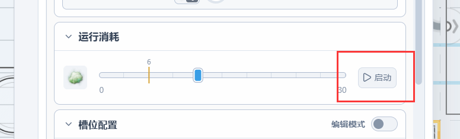
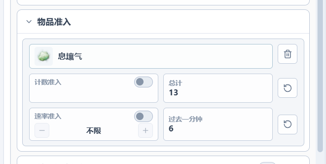

- 需要消耗物品才能运行的设备，现在可在属性面板直接点击启动按钮为其一次性注入5个燃料。方便产线测试时跳过启动流程。

- 物品准入口现在改为查看过去一分钟的流量统计，方便调试产线。(该数字不开启限速也会显示)

- 实验性功能：WebDAV同步 进行了一些优化
- 修复了管道分流器汇流器在特定条件下内容物品异常的问题
- 3D俯视模式下，管道现在在没有流体的时候也会显示箭头了
- 修复了某些情况下，在被抑制的管道上放置传送带时无法正确穿透到下层的问题
- 新增 WASD 键盘平移视口功能
- 放置/移动模式下按下Ctrl+R不会再错误旋转画布。
