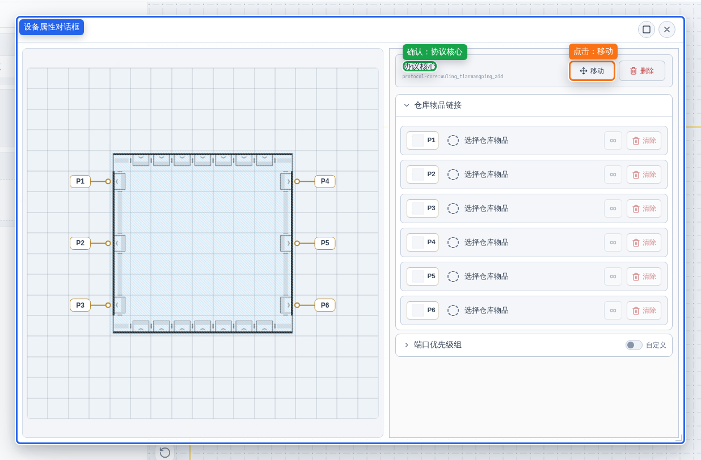
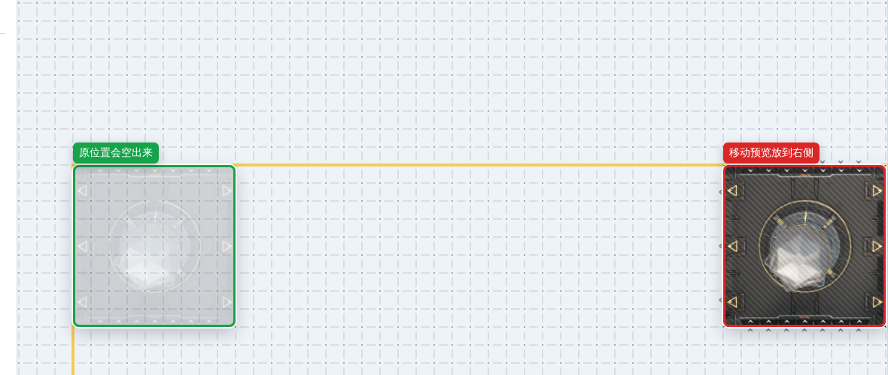
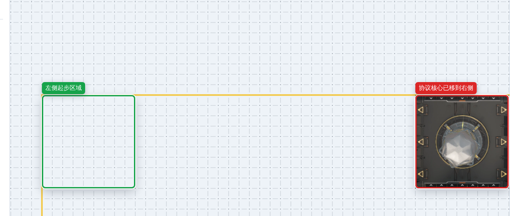

# 新手入门

> 本章节以「重息壤」生产线为例，带你从零开始搭建第一条产线，
> 逐步掌握传送带、管道、暗管、配方选择、仿真运行等核心操作。

---

## 进入页面：先认识界面区域

教程里会反复提到这些区域：

- **顶部工具条**：控制仿真开始、暂停、停止、倍率和全屏。
- **左工具栏**：切换放置模式、蓝图模式、操作历史、基地、帮助等主功能。
- **左面板**：显示当前功能的具体按钮；例如放置模式里是设备列表，基地里是当前基地。
- **中央画布**：摆放设备、传送带和管道的地方；鼠标滚轮缩放，按住空白处拖动可平移视野。
- **底部状态栏**：显示当前工具和缩放比例；点错工具时先看这里确认当前状态。

确认这一步做对了：

- 你能指出左工具栏、左面板、中央画布分别在哪里。
- 后续步骤说“点击左侧基地”“在画布空地拖动”时，你知道对应区域。
- 如果你正在帮助窗口里阅读教程，可以先把帮助窗口移到一旁，或关闭后按步骤操作。

---

## 阶段零：选对基地并移走协议核心

「新手教程」系统蓝图使用的是 **天工坪援建点**。这个基地打开后会自动放置一个很大的 **协议核心**，它默认在画布左上角，会挡住本教程的起步区域。先把它移到右侧空地，后续摆设备时才不会撞到它。

### 第 0-1 步：打开基地面板

1. 把鼠标移动到最左侧的 **左工具栏**。
2. 找到并点击 **基地** 按钮。
3. 左面板标题变成「基地」后，点击面板上方的 **当前基地按钮**。图中示例是「协议核心区」，你的当前基地名称可能不同。

确认这一步做对了：

- 左面板不再显示设备列表，而是显示「基地」「电力」「仓库统计」等内容。
- 当前基地按钮右侧有铅笔图标，点击后会打开「选择基地」对话框。
- 如果你点到了「帮助」或「设置」，再回到左工具栏点击 **基地** 即可。

### 第 0-2 步：选择天工坪援建点

1. 在「选择基地」对话框里找到 **天工坪援建点**。
2. 单击 **天工坪援建点** 这张卡片，让它变成选中状态。
3. 点击对话框右下角的 **确定**。

确认这一步做对了：

- 对话框关闭。
- 左面板当前基地名称变成 **天工坪援建点**。
- 画布左上区域出现一个 9×9 的 **协议核心**。
- 如果你点错了其他基地，但还没点「确定」，重新点击 **天工坪援建点** 即可。

### 第 0-3 步：把协议核心和右侧空地都调整到视野里

1. 把鼠标移动到 **中央画布** 的空白网格上，不要按在协议核心上。
2. 按住鼠标左键拖动画布，让协议核心完整出现在左侧。
3. 滚动鼠标滚轮缩放，直到协议核心右侧能看到一大片空地。

确认这一步做对了：

- 协议核心没有被拖出视野。
- 右侧空地至少能完整放下另一个同样大小的协议核心。
- 如果视野越拖越乱，松开鼠标，换一个空白网格重新按住拖动；滚轮向下通常会缩小视图。

### 第 0-4 步：选中协议核心并点击移动

1. 把鼠标移动到协议核心中间位置。
2. 单击鼠标左键一次，不要拖动。
3. 等「设备属性」对话框出现，确认名称区域显示 **协议核心**。
4. 点击对话框右上操作区里的 **移动**。

确认这一步做对了：

- 设备属性对话框里能看到 **协议核心** 名称。
- 点击 **移动** 后，对话框关闭，鼠标移动时会带着协议核心预览一起移动。
- 如果没有看到 **移动** 按钮，说明没有选中协议核心；先关闭对话框，再重新点击协议核心中间位置。

### 第 0-5 步：把移动预览放到右侧空地

1. 不要按鼠标键，只移动鼠标到协议核心右侧的空地。
2. 让协议核心预览完整落在空地里，不要压到左侧原位置。
3. 如果位置不满意，继续移动鼠标；此时还没有真正放下。

确认这一步做对了：

- 左侧原位置变成半透明提示或空区。
- 右侧能看到完整的协议核心预览。
- 预览没有变红，也没有被画布边界或其他对象挡住。

### 第 0-6 步：确认放下协议核心

1. 预览位置正确后，单击鼠标左键一次。
2. 不要连续点击多次；如果点了多次但画面没有变化，先停下来确认状态栏。

确认这一步做对了：

- 协议核心固定在右侧空地。
- 左侧起步区域被空出来，后续设备从这里开始摆。
- 底部状态栏回到 **工具: 选择**。
- 如果已经放错位置，按 **Ctrl+Z** 撤销，然后从第 0-4 步重新移动。

---

## 阶段一：获取原材料

### 第 1 步：确认起步区域

完成阶段零后，左侧已经空出一块 9×9 的区域。后续教程会从这块空地开始放置设备，不再把设备摆到协议核心下面。

确认这一步做对了：

- 协议核心在右侧，左侧起步区域没有被占用。
- 左工具栏可以切回 **放置模式**。
- 如果左面板还停留在「基地」，点击左工具栏顶部的 **放置模式**，再继续下一步。

---

### 第 2 步：放置存取线源桩和存取线基段

<!-- TODO: 截图 — 存取线源桩和基段放置位置 -->
<!-- TODO: 说明源桩与基段的关系、放置时如何对齐 -->

仓库存取系统需要「存取线源桩」和「存取线基段」配合工作：

1. 在左侧面板「仓库存取」分类中找到 **存取线源桩**，点击选中。
2. 在画布左侧区域点击放置。
3. 同样在「仓库存取」中找到 **存取线基段**，紧挨源桩向右延伸放置。

<!-- TODO: 放置后的验证提示 — 确保基段与源桩对齐，否则取货口无法工作 -->

---

### 第 3 步：放置仓库取货口并选择息壤

<!-- TODO: 截图 — 取货口放置在基段旁 + Inspector面板选择息壤 -->

1. 左侧面板「仓库存取」→ **仓库取货口**，放置在与基段相邻的合适位置。
2. 点击刚放置的取货口，右侧弹出 **Inspector 面板**。
3. 在面板中找到物品选择入口，搜索并选择 **息壤**。
4. 开启 **无限供应**（ignoreStock），确保原料源源不断。

<!-- TODO: 截图 — 无限供应开关的位置 -->
<!-- TODO: 说明仓库物品机制：取货口从全局仓库拉取物品 -->

---

### 第 4 步：铺设第一条传送带

<!-- TODO: 截图 — 传送带铺设过程、方向自动转向效果 -->

1. 左侧面板「操作」区域点击 **铺设传送带**（或按快捷键）。
2. 从仓库取货口的输出端口开始，向画布中央拖动。
3. 传送带会自动转向——遇到拐角时，系统智能选择弯道方向。

<!-- TODO: 说明传送带手动转向方式（如果有） -->
<!-- TODO: 说明如何取消/删除误放的传送带 -->

---

### 第 5 步：放置抽水泵

<!-- TODO: 截图 — 水泵放置位置 + Inspector显示已自动链接清水 -->

1. 左侧面板「资源与电力」→ **抽水泵**，放置在画布上方区域。
2. 抽水泵放置后会自动链接仓库中的 **清水**（无限供应）。

<!-- TODO: 说明水泵的输出端口方向、管道如何接出 -->

---

## 阶段二：暗管铺水

### 第 6 步：放置暗管入口（水）

<!-- TODO: 截图 — 暗管入口紧挨水泵输出端 -->
<!-- TODO: 说明暗管入口的方向/端口朝向要求 -->

1. 左侧面板「仓库存取」→ **暗管入口**，放置在抽水泵管道出口旁。

<!-- TODO: 说明暗管是什么：跨空间传输液体的机制 -->

---

### 第 7 步：放置暗管出口（水）

<!-- TODO: 截图 — 暗管出口放在产线区域附近 -->

1. 在同分类中找到 **暗管出口**，放置在画布中央偏上的产线区域附近。

---

### 第 8 步：建立暗管链接

<!-- TODO: 截图 — 暗管链接工具的视觉提示 -->
<!-- TODO: 说明链接后的视觉反馈（连线颜色/高亮等） -->

1. 点击左侧面板的 **暗管链接** 工具（或通过放置暗管入口后自动激活）。
2. 先点击已放置的暗管入口，再点击暗管出口——完成配对链接。

---

### 第 9 步：铺设管道（水）

<!-- TODO: 截图 — 从暗管出口引出管道 -->

1. 左侧面板「操作」→ **铺设管道**。
2. 从暗管出口的输出端口开始，向画布中央拖出一段管道。
3. 管道与传送带类似，但仅传输液体。

<!-- TODO: 说明管道与传送带的视觉区别和使用差异 -->

---

## 阶段三：反应池一 — 液化息壤

### 第 10 步：放置第一台反应池

<!-- TODO: 截图 — 反应池在画布中央的放置位置 -->
<!-- TODO: 说明反应池的尺寸（5×5）和端口朝向（S入/E入/W出） -->

1. 左侧面板「合成制造」→ **反应池**，放置在画布中央。

---

### 第 11 步：传送带连接（息壤 → 反应池）

<!-- TODO: 截图 — 传送带从取货口连到反应池 S 侧 -->

1. 使用「铺设传送带」工具，将之前从取货口引出的传送带延伸至反应池的 **S 侧**（南侧）输入端口。

---

### 第 12 步：管道连接（水 → 反应池）

<!-- TODO: 截图 — 管道从暗管出口连到反应池 E 侧 -->

1. 使用「铺设管道」工具，将第 9 步引出的水管道延伸至反应池的 **E 侧**（东侧）液体输入端口。

---

### 第 13 步：选择配方（息壤 + 水 → 液化息壤）

<!-- TODO: 截图 — Inspector中配方下拉列表，选中目标配方 -->
<!-- TODO: 说明配方名称在 Inspector 中的显示格式 -->

1. 点击反应池，打开 Inspector 面板。
2. 在配方选择区域，找到并选择：**息壤粉 + 水 → 液化息壤**。

---

### 第 14 步：管道连接（液化息壤输出）

<!-- TODO: 截图 — 从反应池 W 侧引出管道 -->
<!-- TODO: 说明反应池的输出端口在 W 侧（西侧） -->

1. 从反应池的 **W 侧**（西侧）输出端口，用管道向画布下方引出一段。

---

## 阶段四：污水暗管

### 第 15 步：放置暗管入口（污水）

<!-- TODO: 截图 — 暗管入口 + Inspector选择污水 -->

1. 放置一个新的 **暗管入口**。
2. 在 Inspector 面板中选择物品 **污水**，开启无限供应。

<!-- TODO: 说明污水是凭空生成还是需要前提 -->

---

### 第 16 步：放置暗管出口 + 建立链接

<!-- TODO: 截图 — 污水暗管出口位置 + 链接建立 -->

1. 放置对应的 **暗管出口**，位置靠近产线。
2. 使用暗管链接工具，将污水入口与出口配对。

---

### 第 17 步：铺设管道（污水引出）

<!-- TODO: 截图 — 污水管道铺设 -->

1. 从污水暗管出口引出管道，向下延伸至待放反应池上方。

---

## 阶段五：反应池二 — 废液

### 第 18 步：放置第二台反应池

<!-- TODO: 截图 — 第二台反应池位置，位于第一台下游 -->

1. 在画布中央偏下位置放置第二台 **反应池**。

---

### 第 19 步：管道连接（液化息壤 → 反应池二）

<!-- TODO: 截图 — 液化息壤管道接入反应池二 -->

1. 将第 14 步引出的液化息壤管道延伸至反应池二的 **E 侧**输入端口。

---

### 第 20 步：管道连接（污水 → 反应池二）

<!-- TODO: 截图 — 污水管道接入反应池二 -->

1. 将第 17 步引出的污水管道延伸至反应池二的 **E 侧**输入端口。
2. 两条输入管道可通过管道汇流器合并，或分别接入不同的输入端口。

<!-- TODO: 说明如果需要汇流器，放置汇流器和连接方式 -->

---

### 第 21 步：选择配方（液化息壤 + 污水 → 废液）

<!-- TODO: 截图 — Inspector选择废液配方 -->

1. 点击第二个反应池，在 Inspector 中选择配方：**液化息壤 + 污水 → 废液**。

---

## 阶段六：天有洪炉

### 第 22 步：放置天有洪炉

<!-- TODO: 截图 — 洪炉放置位置在最下方 -->
<!-- TODO: 说明洪炉的端口朝向（S入/E入/N出） -->

1. 左侧面板「合成制造」→ **天有洪炉**，放置在画布下方。

---

### 第 23 步：传送带连接（息壤 → 洪炉 S 侧）

<!-- TODO: 截图 — 从取货口引出第二条传送带到洪炉 S 侧 -->
<!-- TODO: 说明传送带分流方式（使用分流器或新取货口） -->

1. 洪炉需要单独的息壤输入。可使用传送带分流器从主干分出，或放置第二个仓库取货口。

<!-- TODO: 推荐方案及操作步骤 -->

---

### 第 24 步：管道连接（废液 → 洪炉 E 侧）

<!-- TODO: 截图 — 废液管道从反应池二连到洪炉 E 侧 -->

1. 从反应池二的 **W 侧**废液输出端口，铺设管道连接至天有洪炉的 **E 侧**液体输入。

---

### 第 25 步：选择配方（息壤 + 废液 → 重息壤）

<!-- TODO: 截图 — Inspector选择重息壤配方 -->

1. 点击天有洪炉，在 Inspector 中选择配方：**息壤 + 废液 → 重息壤**。

---

## 阶段七：供电与存储

### 第 26 步：放置供电桩

<!-- TODO: 截图 — 供电桩位置 + 供电范围覆盖图示 -->
<!-- TODO: 说明供电桩的覆盖范围和耗电设备的要求 -->

1. 左侧面板「资源与电力」→ **供电桩**，放置在生产设备附近。
2. 展开左侧「基地」面板，确认电力系统正常。

<!-- TODO: 说明如何查看设备是否在供电范围内 -->

---

### 第 27 步：放置协议存储箱

<!-- TODO: 截图 — 存储箱放置位置在洪炉 N 侧 -->

1. 左侧面板「仓库存取」→ **协议存储箱**，放置在天有洪炉的 N 侧输出端口旁。

---

### 第 28 步：传送带连接（洪炉输出 → 存储箱）

<!-- TODO: 截图 — 传送带连接洪炉 N 侧和存储箱 -->

1. 从洪炉的 **N 侧**输出端口，用传送带连接至协议存储箱。

---

## 阶段八：启动仿真

### 第 29 步：启动仿真并观察产线

<!-- TODO: 截图 — 仿真运行时的画布状态（物品流动、进度条等） -->
<!-- TODO: 说明速率的含义和如何调节 -->

1. 点击顶部工具栏的 **开始仿真** 按钮。
2. 观察传送带上的息壤移动、管道中的液体流动、设备进度条变化。
3. 点击协议存储箱，查看槽位中积累的 **重息壤**。

<!-- TODO: 说明预期产出速率 — 重息壤 10 秒产 1 个 -->
<!-- TODO: 常见问题排查（如不产出的原因：配方未选、未供电、连接错误等） -->

> 🎉 恭喜！你已经完成了第一条生产线的搭建。
> 试着调节仿真速率（x2 / x4），观察产线加速运行的效果吧。

---

## 下一步

<!-- TODO: 引导用户查看其他帮助章节（功能介绍、配置指南等） -->
