# 新手入门

> 本章节以「重息壤」生产线为例，带你从空白基地开始，手动摆出第一条能运行的产线。
> 你会按真实界面顺序完成：选择基地、移动协议核心、查找设备、摆放建筑、配置取货物品和配方、创建暗管链接、铺设管道和传送带、放置供电、启动仿真，并确认重息壤进入系统仓库。

---

## 进入页面：先认识界面区域

教程里会反复提到这些区域：

- **顶部工具条**：控制仿真开始、暂停、停止、倍率和全屏。
- **左工具栏**：切换放置模式、操作历史、基地、帮助等主功能。
- **左面板**：显示当前功能的具体按钮；例如放置模式里是设备列表，基地里是当前基地。
- **中央画布**：摆放设备、传送带和管道的地方；鼠标滚轮缩放，按住空白处拖动可平移视野。
- **底部状态栏**：显示当前工具和缩放比例；点错工具时先看这里确认当前状态。

确认这一步做对了：

- 你能指出左工具栏、左面板、中央画布分别在哪里。
- 后续步骤说“点击左侧基地”“在画布空地拖动”时，你知道对应区域。
- 如果你正在帮助窗口里阅读教程，可以先把帮助窗口移到一旁，或关闭后按步骤操作。

---

## 阶段零：选对基地并移走协议核心

本教程使用 **天王坪援建点**。这个基地打开后会自动放置一个很大的 **协议核心**，它默认在画布左上角，会挡住后续起步区域。先把它移到右侧空地，后续摆设备时才不会撞到它。

### 第 0-1 步：打开基地面板

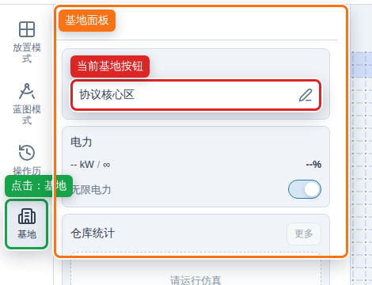

1. 把鼠标移动到最左侧的 **左工具栏**。
2. 点击 **基地** 按钮。
3. 左面板标题变成「基地」后，点击面板上方的 **当前基地按钮**。图中示例是「协议核心区」，你的当前基地名称可能不同。

确认这一步做对了：

- 左面板不再显示设备列表，而是显示「基地」「电力」「仓库统计」等内容。
- 当前基地按钮右侧有铅笔图标，点击后会打开「选择基地」对话框。
- 如果你点到了「帮助」或「设置」，再回到左工具栏点击 **基地** 即可。

### 第 0-2 步：选择天王坪援建点

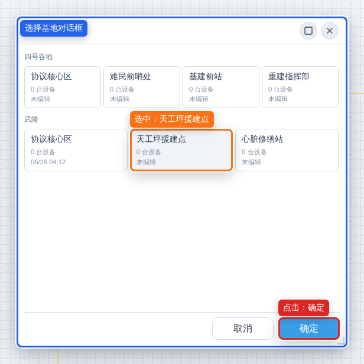

1. 在「选择基地」对话框里找到 **天王坪援建点**。
2. 单击 **天王坪援建点** 这张卡片，让它变成选中状态。
3. 点击对话框右下角的 **确定**。

确认这一步做对了：

- 对话框关闭。
- 左面板当前基地名称变成 **天王坪援建点**。
- 画布左上区域出现一个大型 **协议核心**。
- 如果你点错了其他基地，但还没点「确定」，重新点击 **天王坪援建点** 即可。

### 第 0-3 步：把协议核心和右侧空地都调整到视野里

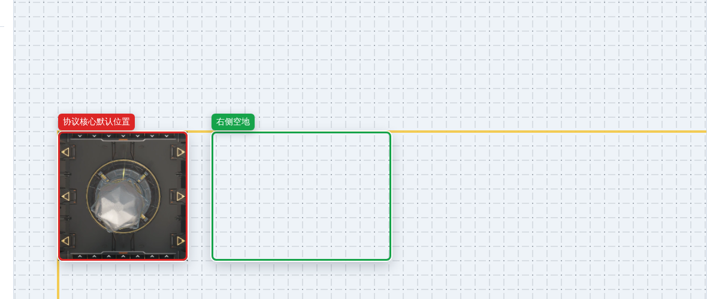

1. 把鼠标移动到 **中央画布** 的空白网格上，不要按在协议核心上。
2. 按住鼠标左键拖动画布，让协议核心完整出现在左侧。
3. 滚动鼠标滚轮缩放，直到协议核心右侧能看到一大片空地。

确认这一步做对了：

- 协议核心没有被拖出视野。
- 右侧空地足够再放下一个大型建筑。
- 如果视野越拖越乱，松开鼠标，换一个空白网格重新按住拖动；滚轮向下通常会缩小视图。

### 第 0-4 步：选中协议核心并点击移动

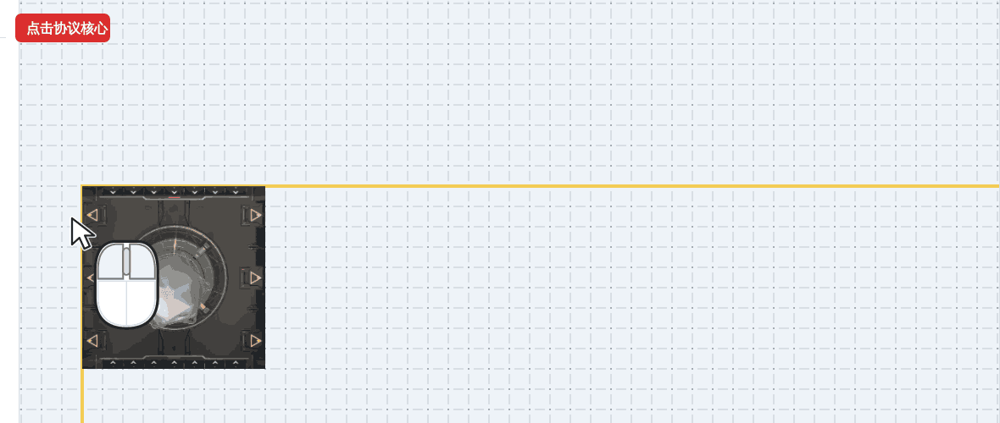

1. 把鼠标移动到协议核心中间位置。
2. 单击鼠标左键一次，不要拖动。
3. 等「设备属性」对话框出现，确认名称区域显示 **协议核心**。
4. 点击对话框右上操作区里的 **移动**。

确认这一步做对了：

- 设备属性对话框里能看到 **协议核心** 名称。
- 点击 **移动** 后，对话框关闭，鼠标移动时会带着协议核心预览一起移动。
- 如果没有看到 **移动** 按钮，说明没有选中协议核心；先关闭对话框，再重新点击协议核心中间位置。

### 第 0-5 步：把移动预览放到右侧空地

1. 不要按鼠标键，只移动鼠标到协议核心右侧的空地。
2. 让协议核心预览完整落在空地里，不要压到左侧原位置。
3. 如果位置不满意，继续移动鼠标；此时还没有真正放下。

确认这一步做对了：

- 左侧原位置变成半透明提示或空区。
- 右侧能看到完整的协议核心预览。
- 预览没有变红，也没有被画布边界或其他对象挡住。

### 第 0-6 步：确认放下协议核心

1. 预览位置正确后，单击鼠标左键一次。
2. 不要连续点击多次；如果点了多次但画面没有变化，先停下来确认状态栏。

确认这一步做对了：

- 协议核心固定在右侧空地。
- 左侧起步区域被空出来，后续设备从这里开始摆。
- 底部状态栏回到 **工具: 选择**。
- 如果已经放错位置，按 **Ctrl+Z** 撤销，然后从第 0-4 步重新移动。

---

## 阶段一：打开放置模式，学会找建筑和放下建筑

这一阶段先练会最重要的基础动作：在哪里找建筑、点击建筑按钮后鼠标会发生什么、如何把建筑放到指定位置。

### 第 1-1 步：打开放置模式并认识设备列表

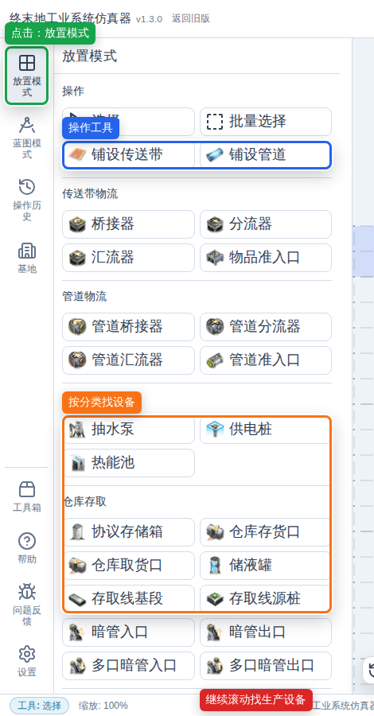

1. 点击左工具栏里的 **放置模式**。
2. 看左面板顶部的「操作」分类，这里有 **选择**、**批量选择**、**铺设传送带**、**铺设管道**。
3. 在左面板里滚动，依次找到这些分类：**传送带物流**、**资源与电力**、**仓库存取**、**基础生产**、**合成制造**。
4. 找建筑时先找分类，再找按钮。例如 **仓库取货口** 在「仓库存取」里，**反应池** 和 **天有洪炉** 在「合成制造」里。

确认这一步做对了：

- 左面板标题显示「放置模式」。
- 你能在同一个面板里看到设备按钮和铺设工具按钮。
- 如果没有看到目标建筑，先滚动左面板，不要在画布上乱点。

### 第 1-2 步：掌握“点击按钮、移动预览、单击放下”的摆放动作

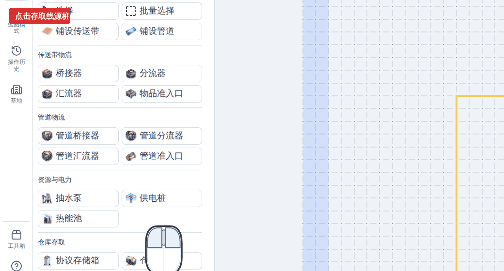

1. 在左面板「仓库存取」分类里点击 **存取线源桩**。
2. 点击按钮后，不要按住鼠标键拖动；只要把鼠标移到中央画布，建筑预览会跟着鼠标移动。
3. 把预览移到阶段零空出来的起步区域。
4. 如果预览方向不对，按 **R** 旋转后再放下。
5. 预览位置合适后，单击鼠标左键一次，把建筑放下。

确认这一步做对了：

- 点击建筑按钮后，鼠标移到画布上能看到建筑预览。
- 预览颜色正常，没有变红。
- 单击后，建筑固定在网格上。
- 如果放错位置，按 **Ctrl+Z** 撤销；如果还没放下但想取消，按 **Esc** 或点击左面板里的 **选择**。

### 第 1-3 步：观察建筑预览和落地后的差异

1. 建筑还跟着鼠标移动时，只是 **预览**，不会真正占用网格。
2. 预览可以继续移动，也可以按 **R** 调整方向。
3. 只有单击左键后，建筑才会真正放下。

确认这一步做对了：

- 你能分清“跟着鼠标走的预览”和“固定在地上的建筑”。
- 后续所有建筑都用同一个动作：先点左面板按钮，再移到画布，再左键放下。

---

## 阶段二：摆出息壤取货起点

这一阶段把仓库里的 **息壤** 拉到产线里。需要先放 **存取线源桩**，再放 **仓库取货口**，最后放 **分流器**。

### 第 2-1 步：放下仓库取货口和分流器

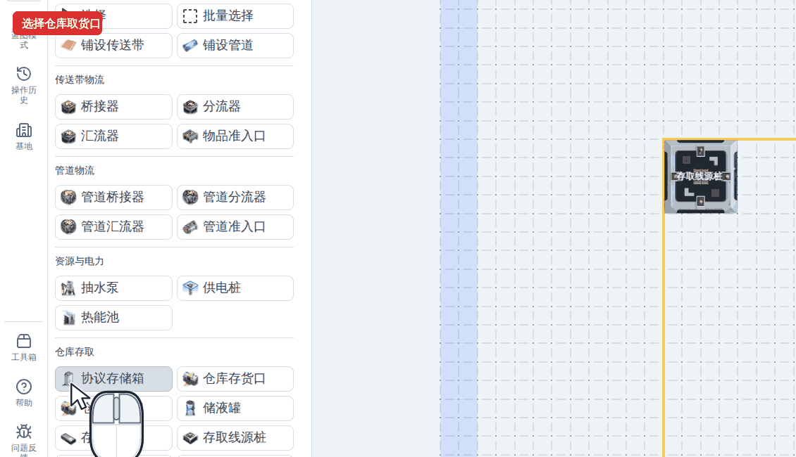

1. 如果当前不是放置模式，先点击左工具栏里的 **放置模式**。
2. 在「仓库存取」分类里点击 **仓库取货口**。
3. 把鼠标移到刚才源桩下方或旁边的连接位置，单击左键放下取货口。
4. 在「传送带物流」分类里点击 **分流器**。
5. 把分流器放在取货口右侧，留出一段传送带起步空间。

确认这一步做对了：

- 画布上能看到 **存取线源桩**、**仓库取货口**、**分流器** 三个对象。
- 取货口靠近源桩，没有离得很远。
- 分流器位于取货口右侧，方便后续一条传送带向右、一条传送带向下。
- 如果取货口或分流器压到其他建筑导致红色预览，移动到空网格后再单击；已经放错就按 **Ctrl+Z**。

### 第 2-2 步：给仓库取货口指定“息壤”

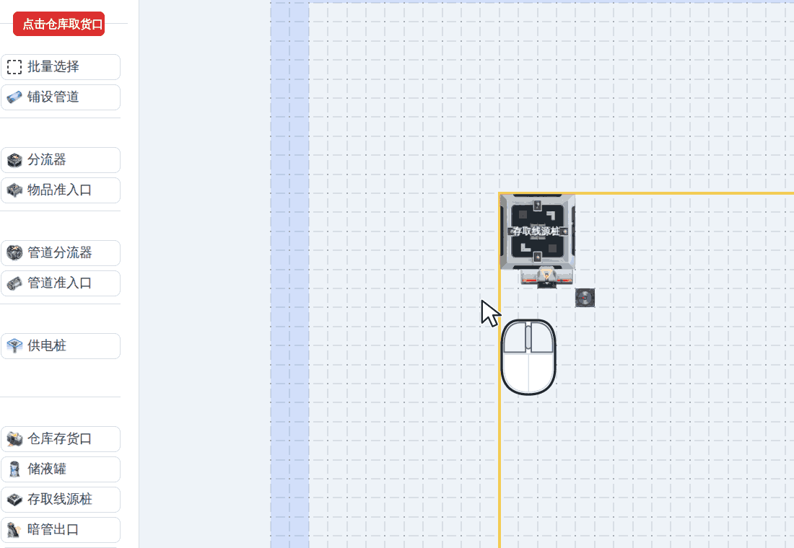

1. 点击画布上的 **仓库取货口**，打开「设备属性」。
2. 在「仓库物品链接」区域里，找到取货口的物品行。
3. 点击这一行里的 **选择仓库物品**。
4. 「选择物品」窗口打开后，点击搜索框，输入 **息壤**。
5. 在结果里点击 **息壤**。注意不要点成 **重息壤**。
6. 回到取货口属性后，点击或确认这一行的 **∞** 按钮处于开启状态。
7. 关闭窗口或点击画布空白处，回到画布。

确认这一步做对了：

- 取货口属性里显示已链接 **息壤**。
- **∞** 是开启状态，表示本教程里可以持续从仓库取出息壤。
- 如果选错物品，重新点击物品按钮，再搜索并选择 **息壤**。

---

## 阶段三：用清水暗管接入反应池

这一阶段需要摆 **抽水泵**、**清水暗管入口**、**清水暗管出口** 和 **反应池**。先完成暗管入口到出口的配对，再用管道把清水送进反应池。

### 第 3-1 步：放下清水设备并创建暗管链接

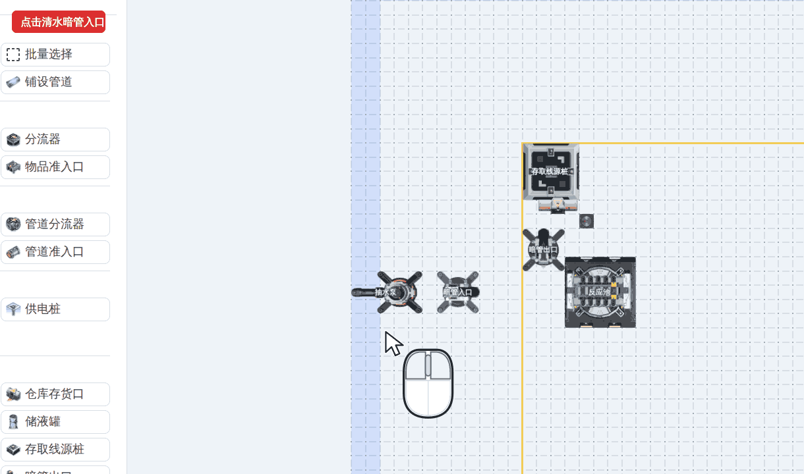

1. 在「资源与电力」分类里点击 **抽水泵**。
2. 把抽水泵放在产线左侧偏下的位置，单击左键放下。
3. 在「仓库存取」分类里点击 **暗管入口**，放在抽水泵右侧。
4. 再点击 **暗管出口**，放在稍后反应池附近。
5. 在「合成制造」分类里点击 **反应池**，把反应池放在暗管出口右侧。
6. 点击清水 **暗管入口**，打开「设备属性」。
7. 在「暗管链接」区域点击 **创建链接**。
8. 对话框关闭后，把鼠标移到清水 **暗管出口** 上，单击一次完成链接。

确认这一步做对了：

- 存取线源桩、仓库取货口和分流器仍在画布上，没有消失。
- 抽水泵、清水暗管入口、清水暗管出口和反应池都在画布上。
- 清水暗管入口和出口之间出现链接线。
- 如果点击 **创建链接** 后不知道下一步做什么，就把鼠标移到目标暗管出口上单击；如果点错出口，重新打开暗管入口属性后再创建链接。

### 第 3-2 步：铺清水管道并接上反应池

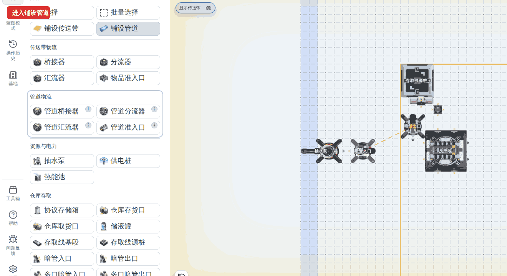

1. 点击左面板「操作」里的 **铺设管道**。
2. 在抽水泵输出侧单击一次，设定管道起点。
3. 移动鼠标到清水暗管入口，看到管道预览后单击确认。
4. 再从清水暗管出口单击起笔。
5. 移动到反应池液体输入侧，单击确认。
6. 铺完后按 **Esc** 或点击 **选择**。

确认这一步做对了：

- 管道从抽水泵进入清水暗管入口。
- 管道从清水暗管出口接到反应池。
- 如果你正在铺管却出现传送带预览，说明工具选错了；按 **Esc** 后重新点 **铺设管道**。

---

## 阶段四：配置反应池配方和输出

这台 **反应池** 要先生产 **液化息壤**，再把液化息壤和 **污水** 转成两种废液。配方必须在设备属性里手动添加。

### 第 4-1 步：打开反应池配方选择

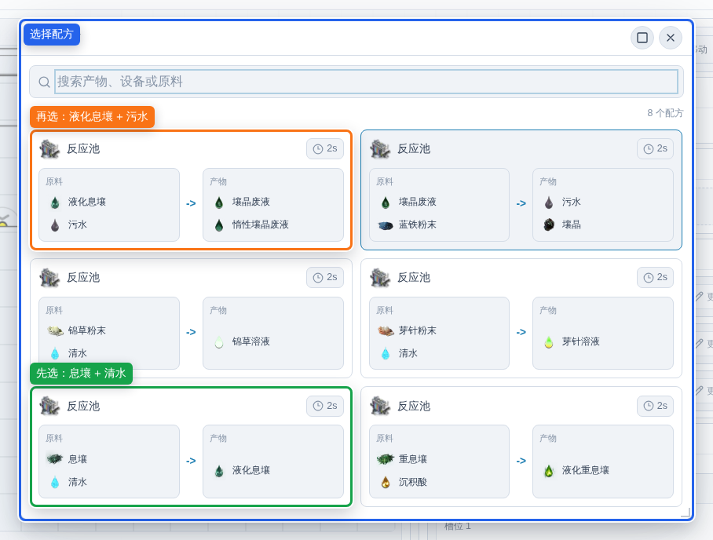

1. 点击画布上的 **反应池**，打开「设备属性」。
2. 找到「配方状态」区域。
3. 点击 **添加配方**。
4. 「选择配方」窗口打开后，找到 **息壤 + 清水 -> 液化息壤** 这一项并点击。
5. 回到设备属性后，再点击一次 **添加配方**。
6. 找到 **液化息壤 + 污水 -> 壤晶废液 + 惰性壤晶废液** 这一项并点击。

确认这一步做对了：

- 反应池「配方状态」里出现两行配方。
- 第一行输入是 **息壤** 和 **清水**，产物是 **液化息壤**。
- 第二行输入是 **液化息壤** 和 **污水**，产物是 **壤晶废液** 和 **惰性壤晶废液**。
- 如果点错配方，删除错误行后重新点击 **添加配方**。

### 第 4-2 步：指定反应池两个液体输出

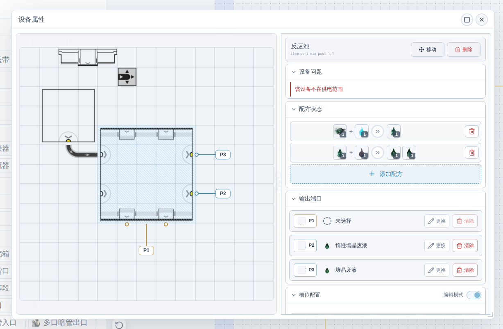

1. 保持反应池的「设备属性」打开。
2. 向下找到「输出端口」区域。
3. 确认一个输出端口是 **壤晶废液**。
4. 确认另一个输出端口是 **惰性壤晶废液**。
5. 如果某个端口不是目标液体，点击这一行的 **更换**。
6. 在选择窗口里搜索目标液体名称，点击对应结果。

确认这一步做对了：

- 反应池至少有一个 **壤晶废液** 输出端口。
- 反应池至少有一个 **惰性壤晶废液** 输出端口。
- 后续接管道时，**壤晶废液** 送到天有洪炉，**惰性壤晶废液** 送到废水处理机。

---

## 阶段五：补上污水供给和废水处理机

第二个反应池配方需要 **污水**。本阶段先配置污水暗管槽位，再把污水暗管出口接到反应池，最后放下废水处理机。废液去向等天有洪炉和废水处理机都在场后再铺。

### 第 5-1 步：放下污水暗管并配置槽位

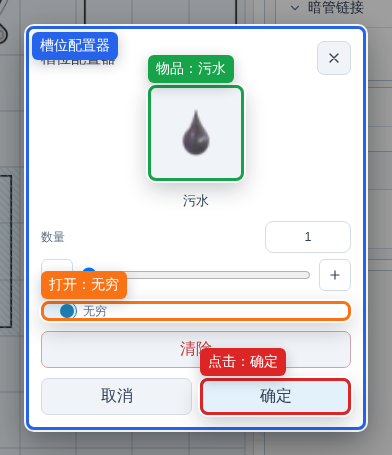

1. 在「仓库存取」分类里点击 **暗管入口**，放在清水暗管下方或旁边，作为污水入口。
2. 再点击 **暗管出口**，放在反应池附近，作为污水出口。
3. 点击污水 **暗管入口**，打开「设备属性」。
4. 在「槽位配置」区域点击 **槽位 1**。
5. 「槽位配置器」打开后，点击物品格里的未选择位置。
6. 在「选择物品」窗口里搜索 **污水**，点击 **污水**。
7. 回到槽位配置器后，点击 **无穷**。
8. 点击右下角 **确定**。

确认这一步做对了：

- 槽位 1 显示 **污水**。
- **无穷** 已开启。
- 如果配置器还显示「未选择物品」，说明没有点到污水结果；重新点击物品格并搜索 **污水**。

### 第 5-2 步：创建污水暗管链接并接到反应池

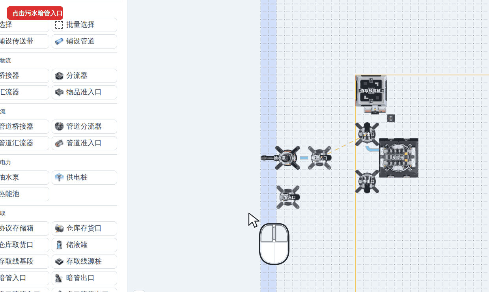

1. 再次点击污水 **暗管入口**。
2. 在「暗管链接」区域点击 **创建链接**。
3. 对话框关闭后，点击刚才放下的污水 **暗管出口**。
4. 点击 **铺设管道**。
5. 从污水暗管出口铺到反应池的液体输入侧。
6. 铺完污水输入管道后按 **Esc** 退出铺设管道。

确认这一步做对了：

- 污水暗管入口和出口之间有链接线。
- 反应池有一条污水输入管。
- 如果污水管道接错端口，先按 **Ctrl+Z** 撤销最后一段，再从污水暗管出口重新铺。

### 第 5-3 步：放下废水处理机

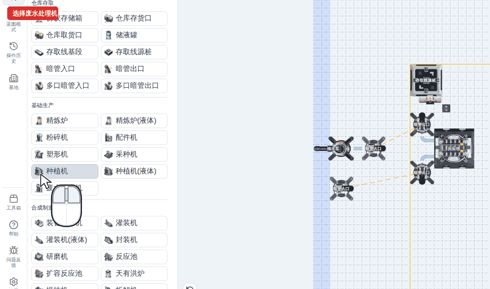

1. 在「基础生产」分类里点击 **废水处理机**。
2. 把废水处理机放在反应池右下方或附近空地。
3. 单击左键放下。

确认这一步做对了：

- 废水处理机已经放在反应池附近。
- 废水处理机此时还没有连接废液管道，等天有洪炉和协议存储箱都在场后再统一铺。
- 如果位置不合适，按 **Ctrl+Z** 撤销后重新放。

---

## 阶段六：摆天有洪炉和协议存储箱

这一阶段只放下最终产物相关设备。先把 **天有洪炉** 放到反应池右上方，再把 **协议存储箱** 放到天有洪炉产物输出侧附近；传送带和废液管道在下一阶段统一连接。

### 第 6-1 步：放下天有洪炉

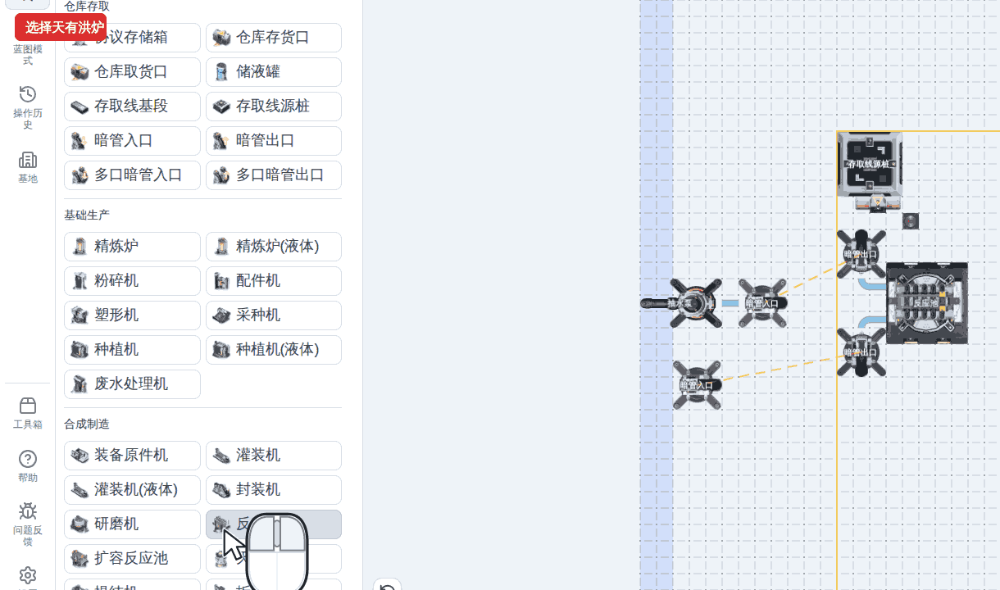

1. 在「合成制造」分类里点击 **天有洪炉**。
2. 把天有洪炉放在反应池右上方的空地上。
3. 如果方向不合适，放下前按 **R** 旋转。
4. 单击左键放下。

确认这一步做对了：

- 画布上已经有源桩、取货口、分流器、反应池、暗管、废水处理机和天有洪炉。
- 天有洪炉还没有接上传送带和管道，这是下一阶段要做的事。
- 如果方向不对，按 **Ctrl+Z** 撤销后重新放。

### 第 6-2 步：放下协议存储箱

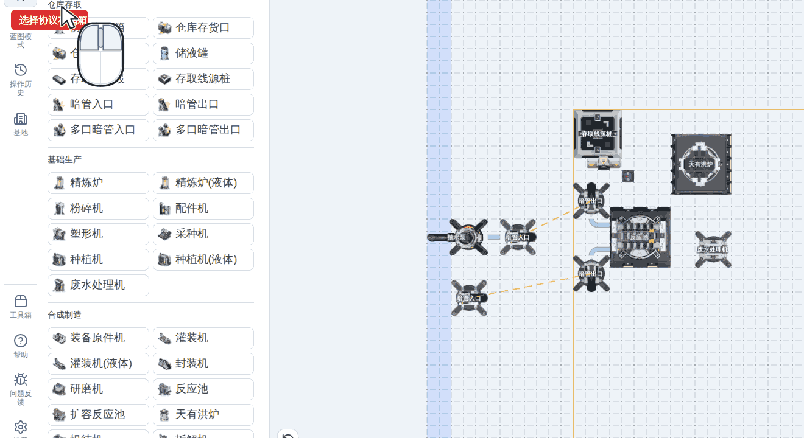

1. 在「仓库存取」分类里点击 **协议存储箱**。
2. 把协议存储箱放在天有洪炉产物输出侧附近。
3. 如果方向不合适，放下前按 **R** 旋转。
4. 单击左键放下。

确认这一步做对了：

- 协议存储箱在天有洪炉旁边。
- 天有洪炉和协议存储箱之间还没有传送带，这是下一阶段要连接的最后一段。
- 如果协议存储箱方向不对，按 **Ctrl+Z** 撤销后重新放。

---

## 阶段七：连接传送带和废液管道

现在所有端点设备都已经放好，再开始铺设传送带和废液管道。这样每一段线都有明确起点和终点，不需要提前向“未来位置”预留。

### 第 7-1 步：从取货口铺到分流器

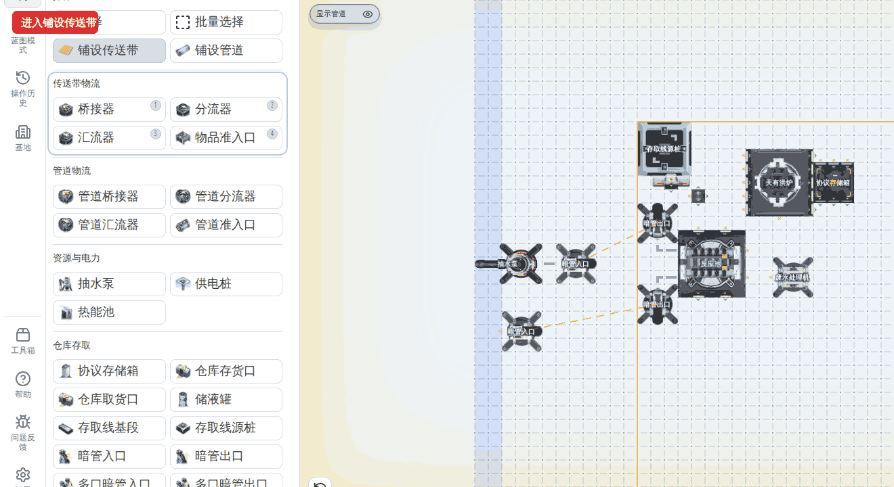

1. 点击左面板「操作」里的 **铺设传送带**。
2. 在仓库取货口输出侧单击一次，设定起点。
3. 移动鼠标到分流器入口侧。
4. 看到预览线从取货口连到分流器后，再单击一次确认终点。

确认这一步做对了：

- 取货口和分流器之间出现一段传送带。
- 传送带箭头方向从取货口指向分流器。
- 如果方向反了，按 **Ctrl+Z** 撤销这一段，从取货口输出侧重新起笔。

### 第 7-2 步：从分流器接到反应池

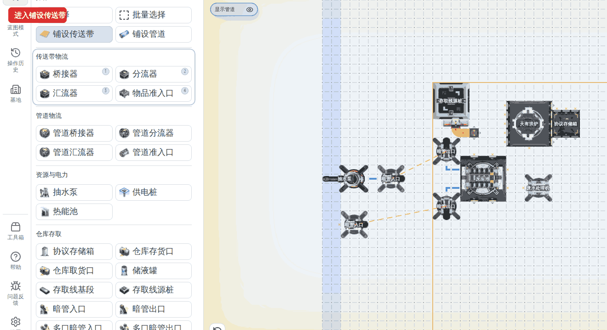

1. 保持 **铺设传送带** 工具。
2. 点击分流器向下的输出位置，作为支路起点。
3. 移动鼠标到反应池的物品输入侧。
4. 预览线方向正确后，单击一次确认。

确认这一步做对了：

- 分流器下方出现一段通向反应池的传送带。
- 反应池既有清水管道，也有息壤传送带输入。

### 第 7-3 步：从分流器接到天有洪炉

1. 点击分流器右侧输出位置，作为主干起点。
2. 移动鼠标到天有洪炉的物品输入侧。
3. 预览线方向正确后，单击一次确认。

确认这一步做对了：

- 分流器右侧出现通向天有洪炉的传送带。
- 天有洪炉现在能收到 **息壤**。

### 第 7-4 步：从天有洪炉接到协议存储箱

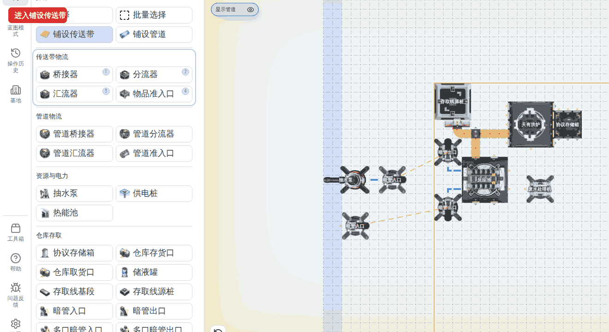

1. 点击天有洪炉产物输出侧，作为起点。
2. 移动鼠标到协议存储箱输入侧。
3. 单击一次确认终点。
4. 铺完后按 **Esc**，或者点击左面板里的 **选择**。

确认这一步做对了：

- 天有洪炉和协议存储箱之间出现传送带。
- 协议存储箱用于接收 **重息壤**。

### 第 7-5 步：连接两条废液管道

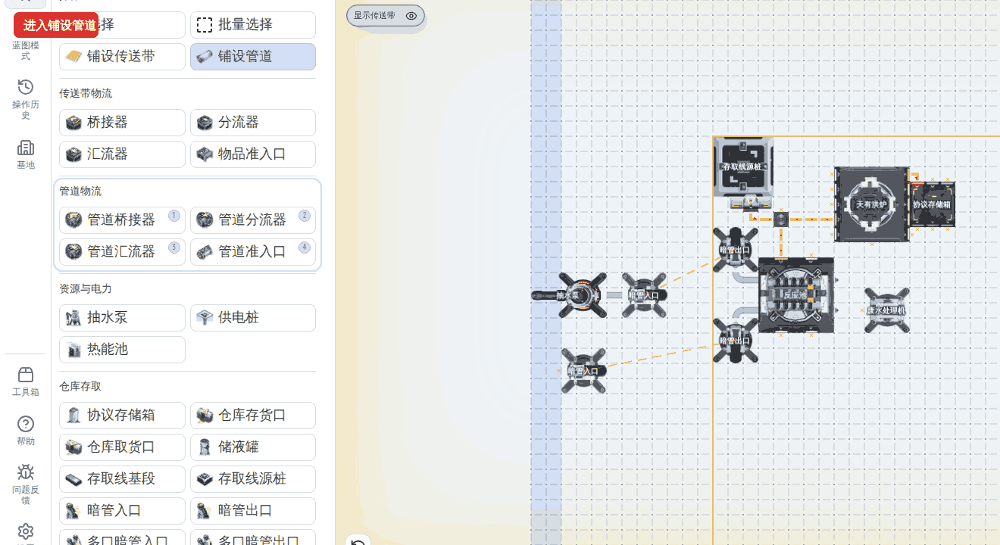

1. 点击左面板「操作」里的 **铺设管道**。
2. 从反应池的 **惰性壤晶废液** 输出端铺管道到废水处理机。
3. 从反应池的 **壤晶废液** 输出端铺管道到天有洪炉。
4. 如果预览线序不对，按 **R** 切换拐弯顺序后再确认。
5. 铺完后按 **Esc** 退出铺设管道。

确认这一步做对了：

- 反应池有一条废液管道通向废水处理机。
- 反应池有一条废液管道通向天有洪炉。
- 天有洪炉同时接到了 **息壤** 传送带和 **壤晶废液** 管道。

---

## 阶段八：放置供电并启动仿真

到这里，物流和管道已经连接完成。最后补上供电，然后启动仿真，让物品和液体真的流动起来，并从基地面板确认 **重息壤** 已进入系统仓库。

### 第 8-1 步：放下供电桩

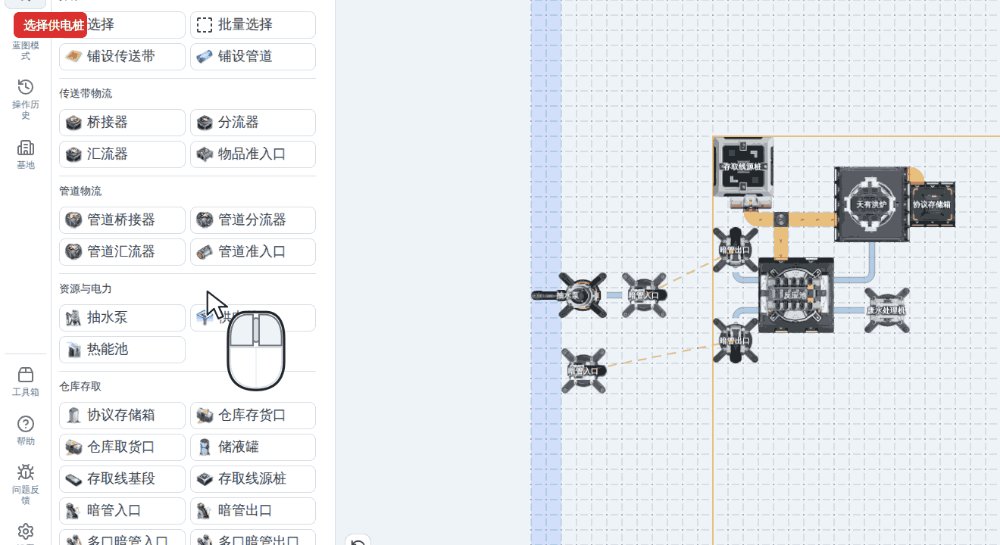

1. 在「资源与电力」分类里点击 **供电桩**。
2. 把供电桩放在反应池、天有洪炉、废水处理机、抽水泵或暗管附近。
3. 如果一个供电桩覆盖不到全部设备，再放第二个供电桩。

确认这一步做对了：

- 关键设备周围有供电桩。
- 设备问题提示里不再显示缺电。

### 第 8-2 步：开始仿真并等待产出

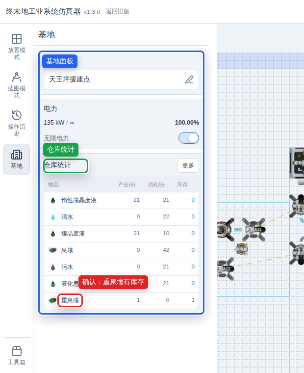

1. 点击顶部工具条里的 **开始仿真**。
2. 如果想更快看到结果，可以点击倍率按钮，把速度调高。
3. 等待一小会儿，让息壤、清水、污水和废液在产线里流动。
4. 点击左工具栏里的 **基地**。
5. 在左面板的「仓库统计」里找到 **重息壤**。

确认这一步做对了：

- 顶部工具条显示仿真正在运行。
- 「仓库统计」里能看到 **重息壤**，并且数量开始出现或增长。
- 看到 **重息壤** 后，这条手动产线就完成了。
- 如果没有重息壤，按下面顺序排查：取货口是否选择 **息壤**，反应池是否有两个配方，污水槽位是否选择 **污水** 并开启 **无穷**，天有洪炉是否接到息壤传送带和壤晶废液管道，协议存储箱是否开启 **自动提交**。

---

## 阶段九：完成后保存蓝图

现在产线已经能运行，并且系统仓库里已经看到 **重息壤**。这时再把你亲手摆好的产线保存成蓝图，方便以后复用。

### 第 9-1 步：框选整条产线

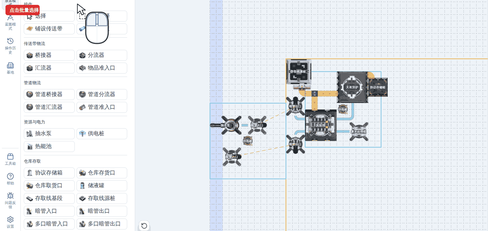

1. 如果仿真还在运行，可以先点击顶部工具条里的暂停或停止，避免画面一直变化。
2. 点击左工具栏里的 **放置模式**。
3. 在左面板「操作」分类里点击 **批量选择**。
4. 把鼠标移动到产线左上方空白处。
5. 按住鼠标左键，拖出一个选择框，把整条产线包含进去。
6. 松开鼠标左键。
7. 右侧出现操作提示后，按键盘 **Ctrl+S** 打开「保存蓝图」对话框。

确认这一步做对了：

- 被选中的设备、传送带和管道周围出现批量选择反馈。
- 右侧能看到 **移动**、**复制选中**、**保存蓝图**、**删除选中** 等快捷键提示；键鼠模式下保存蓝图用 **Ctrl+S**，不要点击右侧提示。
- 如果框少了设备，按 **Esc** 退出选择，再重新从更外侧拖一个更大的框。

### 第 9-2 步：填写并保存

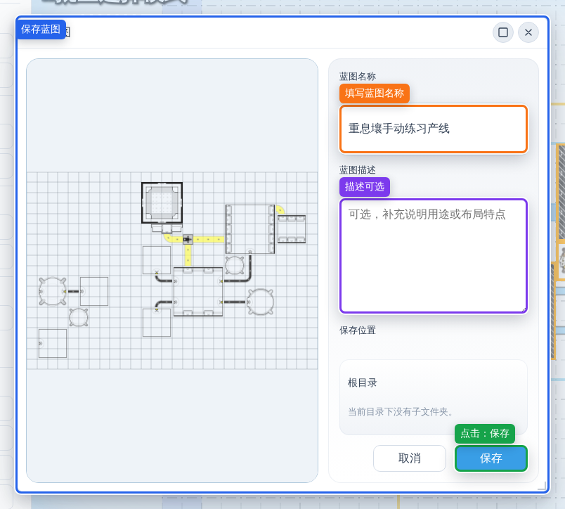

1. 在「保存蓝图」对话框里点击 **蓝图名称** 输入框。
2. 输入一个容易识别的名称，例如 **我的重息壤产线**。
3. 可以在 **蓝图描述** 里写一句用途说明，也可以留空。
4. 确认保存位置是用户可用的位置。
5. 点击右下角 **保存**。

确认这一步做对了：

- 保存对话框关闭。
- 选中的产线仍保留在画布上，没有被删除。
- 如果名称写错，后面可以在用户蓝图列表里重新保存一个新版本。

---

## 阶段十：摆放刚保存的蓝图

这一步只用于复用你刚保存的产线。它不是前面手动搭建流程的一部分。

### 第 10-1 步：从用户蓝图里打开并摆放

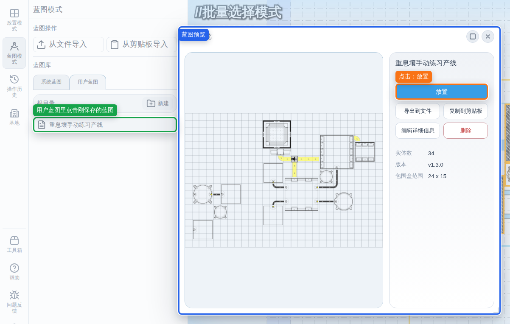

1. 点击左工具栏里的 **蓝图模式**。
2. 在左面板里点击 **用户蓝图**。
3. 找到刚才保存的蓝图，单击它。
4. 「蓝图预览」对话框打开后，点击右侧的 **放置**。
5. 对话框关闭后，把鼠标移到一片空地，观察蓝图预览。
6. 预览没有变红时，单击左键一次放下。
7. 如果预览变红，说明当前位置被占用或放不下；移动到更大的空地再单击。

确认这一步做对了：

- 新的一整条产线出现在画布空地上。
- 放下前如果想取消，按 **Esc**。
- 放下后如果位置不满意，按 **Ctrl+Z** 撤销，再重新点击蓝图 **放置**。

---

## 常见排查顺序

如果启动仿真后没有看到 **重息壤**，按这个顺序查，通常能最快定位问题：

1. **仓库取货口没有出息壤**：点击取货口，确认选择的是 **息壤**，并且 **∞** 开启。
2. **反应池没有液化息壤**：确认反应池第一条配方是 **息壤 + 清水 -> 液化息壤**，清水管道接到了反应池。
3. **反应池没有壤晶废液**：确认第二条配方是 **液化息壤 + 污水 -> 壤晶废液 + 惰性壤晶废液**，污水暗管槽位选择 **污水** 并开启 **无穷**。
4. **废液走错地方**：确认 **壤晶废液** 管道接到 **天有洪炉**，**惰性壤晶废液** 管道接到 **废水处理机**。
5. **天有洪炉不产出**：确认它同时接到了息壤传送带和壤晶废液管道，并且处于供电范围内。
6. **仓库统计没有增加**：确认 **协议存储箱** 接到了天有洪炉输出，并且 **自动提交** 开启。
